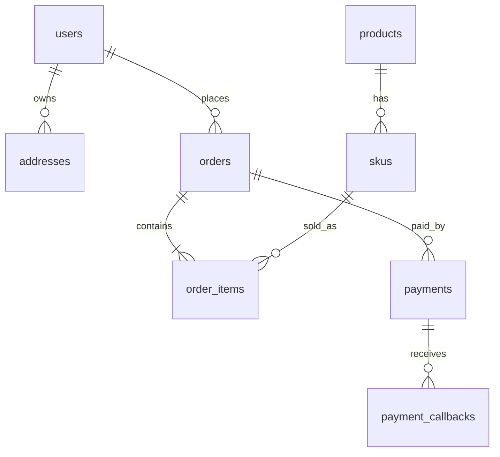

# 示例：最小电商数据库设计

## 1. 设计结论

- 主库：PostgreSQL 或 MySQL。
- Redis：首版非必需；若有验证码、购物车缓存、热点商品缓存、限流，可后续引入。
- 首轮范围：用户、地址、商品、SKU、订单、订单项、支付单、支付回调日志。

## 2. 业务流程证据

| 流程 | 角色 | 页面/入口 | 动作 | 读数据 | 写数据 | 候选对象 |
|---|---|---|---|---|---|---|
| 注册登录 | 买家 | 登录页 | 创建账号/登录 | 用户 | 用户、登录日志 | users, login_logs |
| 浏览商品 | 买家 | 商品列表/详情 | 查看商品 | 商品、SKU | 无 | products, skus |
| 下单 | 买家 | 购物车/结算页 | 创建订单 | 用户、地址、SKU | 订单、订单项 | orders, order_items |
| 支付 | 买家/支付平台 | 支付页/回调 | 支付订单 | 订单 | 支付单、回调日志 | payments, payment_callbacks |

## 3. 核心对象

| 对象 | 职责 | 类型 | 是否核心 | 快照 |
|---|---|---|---|---|
| users | 账号与认证主体 | 主体 | 是 | 否 |
| addresses | 用户收货地址 | 资源 | 是 | 订单中需要快照 |
| products | 商品 SPU | 资源 | 是 | 订单项需要名称快照 |
| skus | 具体可售 SKU | 资源 | 是 | 订单项需要价格快照 |
| orders | 订单主单 | 交易 | 是 | 收货信息快照 |
| order_items | 订单明细 | 交易 | 是 | 商品/SKU 快照 |
| payments | 支付单 | 交易 | 是 | 第三方流水 |
| payment_callbacks | 支付回调日志 | 日志 | 是 | 原始回调摘要/脱敏 |

## 4. 关系矩阵

| 主对象 | 从对象 | 关系 | 外键/中间表 | 删除策略 | 说明 |
|---|---|---|---|---|---|
| users | addresses | 1:N | addresses.user_id | Soft Delete | 地址可被用户停用 |
| users | orders | 1:N | orders.user_id | Restrict/Soft Delete | 历史订单必须保留 |
| products | skus | 1:N | skus.product_id | Restrict | 有订单后不能随意删除 |
| orders | order_items | 1:N | order_items.order_id | Cascade/Restrict | 订单项依赖订单 |
| orders | payments | 1:N | payments.order_id | Restrict | 可多次支付尝试 |
| payments | payment_callbacks | 1:N | payment_callbacks.payment_id | Restrict | 审计与对账 |

## 5. Mermaid ERD



## 6. 关键反范式

- `orders.shipping_name`、`shipping_phone`、`shipping_address`：订单收货快照，避免用户后续修改地址影响历史订单。
- `order_items.product_name`、`sku_name`、`unit_price_cents`：商品与价格快照，避免商品改名/改价影响历史订单。

## 7. PostgreSQL Schema 示例

```sql
CREATE TABLE users (
  id BIGINT GENERATED BY DEFAULT AS IDENTITY PRIMARY KEY,
  email TEXT NOT NULL UNIQUE,
  password_hash TEXT NOT NULL,
  status TEXT NOT NULL DEFAULT 'active' CHECK (status IN ('active', 'disabled')),
  created_at TIMESTAMPTZ NOT NULL DEFAULT now(),
  updated_at TIMESTAMPTZ NOT NULL DEFAULT now(),
  deleted_at TIMESTAMPTZ
);

CREATE TABLE products (
  id BIGINT GENERATED BY DEFAULT AS IDENTITY PRIMARY KEY,
  title TEXT NOT NULL,
  status TEXT NOT NULL DEFAULT 'draft' CHECK (status IN ('draft','active','archived')),
  created_at TIMESTAMPTZ NOT NULL DEFAULT now(),
  updated_at TIMESTAMPTZ NOT NULL DEFAULT now(),
  deleted_at TIMESTAMPTZ
);

CREATE TABLE skus (
  id BIGINT GENERATED BY DEFAULT AS IDENTITY PRIMARY KEY,
  product_id BIGINT NOT NULL REFERENCES products(id) ON DELETE RESTRICT,
  sku_code TEXT NOT NULL UNIQUE,
  name TEXT NOT NULL,
  price_cents BIGINT NOT NULL CHECK (price_cents >= 0),
  currency CHAR(3) NOT NULL DEFAULT 'CNY',
  stock_quantity INTEGER NOT NULL DEFAULT 0 CHECK (stock_quantity >= 0),
  created_at TIMESTAMPTZ NOT NULL DEFAULT now(),
  updated_at TIMESTAMPTZ NOT NULL DEFAULT now(),
  deleted_at TIMESTAMPTZ
);

CREATE TABLE orders (
  id BIGINT GENERATED BY DEFAULT AS IDENTITY PRIMARY KEY,
  user_id BIGINT NOT NULL REFERENCES users(id) ON DELETE RESTRICT,
  order_no TEXT NOT NULL UNIQUE,
  status TEXT NOT NULL DEFAULT 'pending_payment' CHECK (status IN ('pending_payment','paid','cancelled','fulfilled','completed','refunding','refunded')),
  total_amount_cents BIGINT NOT NULL CHECK (total_amount_cents >= 0),
  currency CHAR(3) NOT NULL DEFAULT 'CNY',
  shipping_name TEXT NOT NULL,
  shipping_phone TEXT NOT NULL,
  shipping_address TEXT NOT NULL,
  paid_at TIMESTAMPTZ,
  cancelled_at TIMESTAMPTZ,
  created_at TIMESTAMPTZ NOT NULL DEFAULT now(),
  updated_at TIMESTAMPTZ NOT NULL DEFAULT now(),
  deleted_at TIMESTAMPTZ
);

CREATE INDEX orders_user_created_at_idx ON orders (user_id, created_at DESC);
CREATE INDEX orders_status_created_at_idx ON orders (status, created_at DESC);

CREATE TABLE order_items (
  id BIGINT GENERATED BY DEFAULT AS IDENTITY PRIMARY KEY,
  order_id BIGINT NOT NULL REFERENCES orders(id) ON DELETE RESTRICT,
  sku_id BIGINT NOT NULL REFERENCES skus(id) ON DELETE RESTRICT,
  product_name TEXT NOT NULL,
  sku_name TEXT NOT NULL,
  unit_price_cents BIGINT NOT NULL CHECK (unit_price_cents >= 0),
  quantity INTEGER NOT NULL CHECK (quantity > 0),
  subtotal_cents BIGINT NOT NULL CHECK (subtotal_cents >= 0),
  created_at TIMESTAMPTZ NOT NULL DEFAULT now()
);

CREATE INDEX order_items_order_id_idx ON order_items(order_id);

CREATE TABLE payments (
  id BIGINT GENERATED BY DEFAULT AS IDENTITY PRIMARY KEY,
  order_id BIGINT NOT NULL REFERENCES orders(id) ON DELETE RESTRICT,
  provider TEXT NOT NULL,
  provider_trade_no TEXT,
  amount_cents BIGINT NOT NULL CHECK (amount_cents >= 0),
  currency CHAR(3) NOT NULL DEFAULT 'CNY',
  status TEXT NOT NULL DEFAULT 'pending' CHECK (status IN ('pending','succeeded','failed','cancelled','refunded')),
  paid_at TIMESTAMPTZ,
  created_at TIMESTAMPTZ NOT NULL DEFAULT now(),
  updated_at TIMESTAMPTZ NOT NULL DEFAULT now(),
  UNIQUE(provider, provider_trade_no)
);

CREATE TABLE payment_callbacks (
  id BIGINT GENERATED BY DEFAULT AS IDENTITY PRIMARY KEY,
  payment_id BIGINT REFERENCES payments(id) ON DELETE RESTRICT,
  provider TEXT NOT NULL,
  event_type TEXT NOT NULL,
  event_id TEXT,
  payload_hash TEXT,
  received_at TIMESTAMPTZ NOT NULL DEFAULT now(),
  processed_at TIMESTAMPTZ,
  status TEXT NOT NULL DEFAULT 'received' CHECK (status IN ('received','processed','ignored','failed')),
  UNIQUE(provider, event_id)
);
```

## 8. 验收标准

- 能创建用户、商品、SKU、订单、订单项、支付单。
- 不允许订单引用不存在的用户。
- 不允许订单项数量小于等于 0。
- 不允许重复订单号。
- 用户修改地址后，历史订单收货快照不变化。
- 支付回调能幂等记录。
