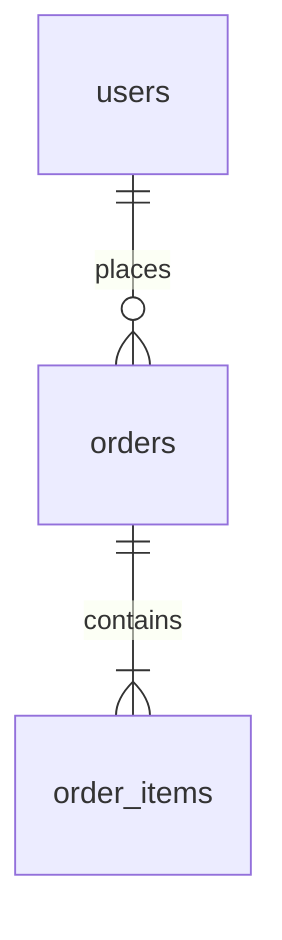

# 对象关系矩阵

| 主对象 | 从对象 | 关系类型 | 外键位置 / 中间表 | 是否必填 | 删除策略 | 唯一约束 | 业务说明 |
|---|---|---|---|---|---|---|---|

## 关系类型

- 1:1：一对一。
- 1:N：一对多。
- M:N：多对多。
- Optional：可选关联。
- Snapshot：历史快照，不直接依赖当前主数据。
- Event：事件/日志关系。

## 外键放置规则

- 一对多：外键放在“多”的一方。
- 多对多：建立中间表。
- 中间表有业务属性时，必须把它视为独立业务表。
- 历史数据不能依赖会变化的当前资料，应使用快照字段或快照表。
- 删除策略必须说明：Restrict / Cascade / Set Null / Soft Delete / No Action。

## Mermaid ERD 占位

