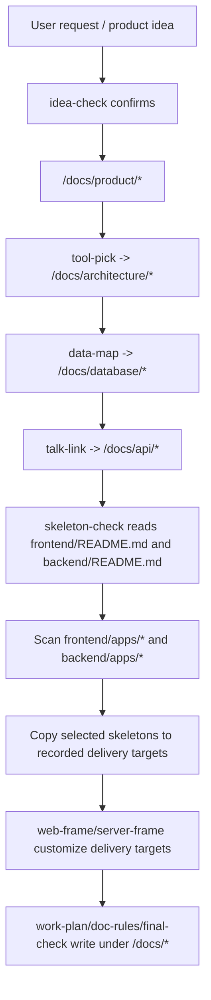

# docs: Align workflow skills with target project roots

## Summary

Update the workflow skills and skeleton index docs so `work-bench` is consistently treated as a reusable skill and skeleton library, while project-specific output lands under a confirmed `<project-root>`.

---

## Problem Frame

The current workflow text still mostly describes stage outputs as `docs/...` without consistently naming whether those docs belong to `work-bench` or the target project. `skeleton-check` also scans candidate directories directly, but the new requirement makes `frontend/README.md` and `backend/README.md` the first-class skeleton indexes. Without these updates, agents can write project docs into the wrong repository, copy `apps` into real projects, or miss the index maintenance step when adding skeletons.

---

## Requirements

- R1. Skills must use `target project root`, `real project root`, `<project-root>`, and delivery-target wording instead of single-letter placeholders.
- R2. `idea-check` must require a confirmed target project root before any project-specific file writes, copies, or generation.
- R3. Product, architecture, database, API, delivery, documentation, and quality outputs must be described as `<project-root>/docs/...`.
- R4. `skeleton-check` must read `frontend/README.md` and `backend/README.md` before scanning `frontend/apps/*` or `backend/apps/*`.
- R5. Reused skeletons must copy from the work-bench skeleton libraries into the recorded frontend/backend delivery targets, defaulting to `<project-root>/frontend` and `<project-root>/backend`.
- R6. Newly created skeleton candidates must be added under the work-bench skeleton library, indexed in the relevant README, and then copied to the recorded delivery target.
- R7. The target project root must not receive nested `frontend/apps` or `backend/apps` paths unless the user explicitly requests that structure.
- R8. `frontend/README.md` and `backend/README.md` must remain skeleton library indexes and must not include target-project-root delivery rules.
- R9. `final-check` must verify the target project root and write quality evidence under `<project-root>/docs/quality/*`.

---

## Key Technical Decisions

- **Keep `work-bench` as the library boundary:** Skill text should separate the skeleton candidate library from the target project root instead of trying to make `work-bench` a sample target project.
- **Make `<project-root>` the portable placeholder:** Plans and skills should avoid absolute paths and single-letter aliases so the rules travel across machines, worktrees, and future projects.
- **Use README indexes as skeleton discovery inputs:** `skeleton-check` should read the frontend/backend index files before directory scanning so candidate descriptions, suitability, and index-maintenance rules stay authoritative.
- **Preserve local skill structure:** Update the top contract sections and targeted inherited-rule passages instead of rewriting the large legacy rule libraries wholesale.
- **Validate through static checks:** This is documentation and workflow-contract work; verification should focus on JSON validity, path wording, forbidden terms, required references, and consistency across stage metadata.

---

## High-Level Technical Design

---

## Scope Boundaries

In scope:

- Update workflow skill text and metadata so the new target-project-root rules are explicit.
- Improve the frontend/backend skeleton index README files so they describe available candidates and index-maintenance expectations.
- Add static validation checks that an implementer can run manually while reviewing the change.

Deferred to follow-up work:

- Build an executable workflow runner that enforces these rules automatically.
- Add automated tests around skill parsing or skeleton copying.
- Create new frontend or backend skeleton candidates.

Outside this plan:

- Changing the actual frontend/backend application skeleton implementations.
- Running the full workflow against a real target project.
- Modifying the already-created requirements document except for minor typo fixes discovered during implementation.

---

## Implementation Units

### U1. Update target-project-root contracts in stage skills

- **Goal:** Make the core workflow stages consistently describe project-specific outputs as landing under `<project-root>/docs/...`.
- **Requirements:** R1, R2, R3, R9.
- **Dependencies:** None.
- **Files:**
  - `.codex/skills/00-build-map/SKILL.md`
  - `.codex/skills/01-idea-check/SKILL.md`
  - `.codex/skills/02-tool-pick/SKILL.md`
  - `.codex/skills/03-data-map/SKILL.md`
  - `.codex/skills/04-talk-link/SKILL.md`
  - `.codex/skills/08-work-plan/SKILL.md`
  - `.codex/skills/09-doc-rules/SKILL.md`
  - `.codex/skills/10-final-check/SKILL.md`
- **Approach:** Update the top-level input/output contracts, completion gates, and recommended landing sections to name the target project root. Keep the legacy inherited sections intact unless they directly contradict the new rule.
- **Patterns to follow:** Use the concise contract style already present in `.codex/skills/04-talk-link/SKILL.md` and `.codex/skills/08-work-plan/SKILL.md`.
- **Test scenarios:**
  - Confirm all modified stages mention `<project-root>/docs/...` for project-specific outputs.
  - Confirm no modified skill introduces a single-letter project-root placeholder.
  - Confirm `final-check` describes verifying the target project root rather than `work-bench`.
- **Verification:** Static review shows output paths and gate language align with `docs/requirements/workflow-project-root-and-skeletons.md`.

### U2. Strengthen skeleton-check around index-first discovery and copy boundaries

- **Goal:** Make `skeleton-check` explicitly read skeleton indexes before scanning candidates and define reuse/create copy behavior.
- **Requirements:** R4, R5, R6, R7.
- **Dependencies:** U1 for shared terminology.
- **Files:**
  - `.codex/skills/05-skeleton-check/SKILL.md`
  - `.codex/skills/05-skeleton-check/skill.json`
  - `.codex/skills/06-web-frame/SKILL.md`
  - `.codex/skills/07-server-frame/SKILL.md`
- **Approach:** Add `frontend/README.md` and `backend/README.md` to the upstream input contract, clarify candidate-library versus delivery-target responsibilities, and state that real projects do not receive nested `apps` directories by default. Ensure `web-frame` and `server-frame` consume copied delivery targets rather than library candidates directly.
- **Patterns to follow:** Preserve the current stage numbering and `reuse/create` terminology already used by `.codex/skills/05-skeleton-check/SKILL.md`.
- **Test scenarios:**
  - Confirm `skeleton-check` names both README indexes before `frontend/apps/*` and `backend/apps/*`.
  - Confirm reuse flow copies from a selected candidate to a recorded delivery target.
  - Confirm create flow adds the candidate to the library, updates the relevant README, and then copies to the delivery target.
  - Confirm nested target paths such as `<project-root>/frontend/apps` are forbidden by default.
- **Verification:** Static search validates required README references and forbidden nested-copy language.

### U3. Convert frontend/backend README files into skeleton indexes

- **Goal:** Make the two README files useful as candidate indexes without embedding target-project-root rules.
- **Requirements:** R4, R6, R8.
- **Dependencies:** U2.
- **Files:**
  - `frontend/README.md`
  - `backend/README.md`
- **Approach:** Expand each README into an index with candidate directory, stack, best-fit scenario, poor-fit scenario, and local guidance links. Add a short rule that new candidates must update the index in the same change.
- **Patterns to follow:** Keep the current table-based index style from both README files, but add columns only where the information is uniform enough to scan.
- **Test scenarios:**
  - Confirm each existing candidate under `frontend/apps/*` and `backend/apps/*` appears exactly once in the relevant README.
  - Confirm each README mentions local candidate docs such as README, AGENTS.md, docs, and verification commands.
  - Confirm neither README mentions `<project-root>/frontend`, `<project-root>/backend`, or user-specific delivery paths.
- **Verification:** Static search and manual table review confirm the indexes are complete and delivery-target-free.

### U4. Align skill metadata with the final 01-10 workflow graph

- **Goal:** Keep `skill.json` metadata consistent with the visible `build-map` sequence and the new skeleton-check dependency.
- **Requirements:** R4, R5, R9.
- **Dependencies:** U1, U2.
- **Files:**
  - `.codex/skills/00-build-map/skill.json`
  - `.codex/skills/01-idea-check/skill.json`
  - `.codex/skills/02-tool-pick/skill.json`
  - `.codex/skills/03-data-map/skill.json`
  - `.codex/skills/04-talk-link/skill.json`
  - `.codex/skills/05-skeleton-check/skill.json`
  - `.codex/skills/06-web-frame/skill.json`
  - `.codex/skills/07-server-frame/skill.json`
  - `.codex/skills/08-work-plan/skill.json`
  - `.codex/skills/09-doc-rules/skill.json`
  - `.codex/skills/10-final-check/skill.json`
- **Approach:** Ensure every stage has a metadata file, `workflow_stage` values are continuous from `01` to `10`, and downstream stages that depend on skeleton selection include `skeleton-check` in their upstream list.
- **Patterns to follow:** Match the existing JSON shape used by `.codex/skills/04-talk-link/skill.json`.
- **Test scenarios:**
  - Confirm every `.codex/skills/*/skill.json` parses as valid JSON.
  - Confirm stage metadata is continuous from `01` through `10`.
  - Confirm `web-frame`, `server-frame`, `work-plan`, `doc-rules`, and `final-check` include `skeleton-check` where appropriate.
- **Verification:** JSON parsing and static stage-order inspection pass.

### U5. Run static consistency checks and update acceptance notes

- **Goal:** Give reviewers confidence that the workflow text, indexes, and metadata now satisfy the requirements.
- **Requirements:** R1 through R9.
- **Dependencies:** U1, U2, U3, U4.
- **Files:**
  - `docs/requirements/workflow-project-root-and-skeletons.md`
  - `.codex/skills/00-build-map/SKILL.md`
  - `.codex/skills/01-idea-check/SKILL.md`
  - `.codex/skills/02-tool-pick/SKILL.md`
  - `.codex/skills/03-data-map/SKILL.md`
  - `.codex/skills/04-talk-link/SKILL.md`
  - `.codex/skills/05-skeleton-check/SKILL.md`
  - `.codex/skills/06-web-frame/SKILL.md`
  - `.codex/skills/07-server-frame/SKILL.md`
  - `.codex/skills/08-work-plan/SKILL.md`
  - `.codex/skills/09-doc-rules/SKILL.md`
  - `.codex/skills/10-final-check/SKILL.md`
  - `frontend/README.md`
  - `backend/README.md`
- **Approach:** Check for forbidden or ambiguous wording, required README-index references, path placement, and JSON validity. Record any remaining accepted limitations in the final implementation report rather than inventing code tests.
- **Patterns to follow:** Mirror the static checks already used during earlier review: keyword scans, JSON parsing, and git diff review.
- **Test scenarios:**
  - Confirm no skill or index uses a single-letter placeholder as the project root.
  - Confirm target-project output paths use `<project-root>/docs/...` where relevant.
  - Confirm skeleton index README files do not include delivery-target rules.
  - Confirm no changed text instructs copying `apps` into the target project by default.
- **Verification:** Static checks pass or any exception is documented with a concrete reason.

---

## Risks & Dependencies

- **Existing dirty workspace:** Some skill fixes may already be present locally. The implementer should inspect the diff first and avoid reverting unrelated or user-authored changes.
- **Legacy inherited sections:** Several skill files contain long inherited rule libraries. The plan avoids rewriting them wholesale, but obvious contradictions with `<project-root>` should still be corrected.
- **README scope creep:** The frontend/backend README files should remain skeleton indexes only; adding target-project delivery rules there would violate the requirements.
- **No runtime enforcement yet:** This plan changes documented behavior and metadata, not an executable workflow runner.

---

## Documentation / Operational Notes

The final implementation report should list the static checks run and call out that no application tests are expected for documentation-only changes. If future work adds a workflow runner, this plan's requirements can become automated tests.

---

## Sources & Research

- `docs/requirements/workflow-project-root-and-skeletons.md` is the source of truth for the requirements.
- `.codex/skills/00-build-map/SKILL.md` defines the current 10-stage workflow.
- `.codex/skills/05-skeleton-check/SKILL.md` currently owns skeleton candidate selection.
- `frontend/README.md` and `backend/README.md` are the skeleton library indexes to strengthen.
