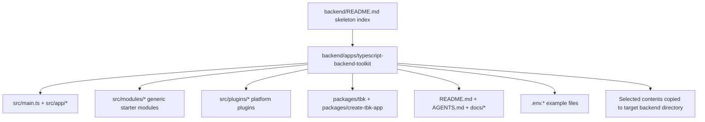

# refactor: Standardize the TypeScript backend toolkit skeleton

## Summary

Rename the TypeScript backend skeleton from `backend/apps/typescript-app` to `backend/apps/typescript-backend-toolkit`, then align its index entry, local README, AGENTS guidance, docs, environment examples, and verification posture with its actual Express + MongoDB + Redis/BullMQ + plugin-oriented toolkit shape.

---

## Problem Frame

The skeleton already contains a substantial TypeScript backend toolkit: Express runtime assembly, MagicRouter, OpenAPI, auth, admin, realtime, observability, cache, queues, `packages/tbk`, and `packages/create-tbk-app`. The surrounding skeleton-library contract still presents it as `typescript-app`, points `backend/README.md` at a missing root README, and leaves some docs with stale references such as `CLAUDE.md`.

Without this cleanup, `skeleton-check` may select the right candidate but hand later stages an unclear or partially documented skeleton. The copied project should receive the skeleton contents under its backend delivery target, while the reusable candidate remains indexed under the work-bench backend skeleton library.

---

## Requirements

**Skeleton identity**

- R1. The backend skeleton candidate must live at `backend/apps/typescript-backend-toolkit`.
- R2. `backend/README.md` must list `apps/typescript-backend-toolkit` exactly once and stop recommending `apps/typescript-app`.
- R3. Package identity should remain `typescript-backend-toolkit` unless implementation finds a concrete conflict.

**Documentation contract**

- R4. The skeleton must have a root `README.md` that explains purpose, stack, commands, copy boundary, adaptation points, and verification.
- R5. `AGENTS.md` and `docs/*` must describe the skeleton as a reusable backend toolkit, not a finished business product.
- R6. Docs must remove or correct stale references to missing files such as a root `CLAUDE.md`, while preserving real references inside generated templates when they exist.
- R7. Docs must state that selecting this candidate copies its contents into the target backend delivery directory by default, not into a nested `backend/apps` path.

**Runtime and toolkit confidence**

- R8. Startup and app assembly docs must match `src/main.ts`, `src/app/app.ts`, and `src/app/createApp.ts`.
- R9. Route, schema, OpenAPI, plugin, queue, cache, auth, admin, realtime, observability, lifecycle, and security docs must match the real files under `src/`.
- R10. `packages/tbk` and `packages/create-tbk-app` docs must stay aligned with the commands and generated project shape they expose.
- R11. Add or repair only focused starter verification where basic confidence is missing; do not turn this plan into a product-feature build.

**Environment and delivery safety**

- R12. `.env.development` and `.env.production` must remain example files with local or dummy values only.
- R13. No cache, dependency install, build output, virtual environment, or machine-local artifact should be included in the final change.

---

## Key Technical Decisions

- KTD1. **Treat this as a skeleton refactor, not a new skeleton:** The package and code already target `typescript-backend-toolkit`; the work should rename the candidate directory and tighten surrounding contracts instead of creating a parallel copy.
- KTD2. **Use `backend/README.md` only as the skeleton-library index:** Target-project copy rules belong in the candidate README and workflow skills, while the backend index remains a catalog of reusable candidates.
- KTD3. **Keep the skeleton generic:** Auth, user, upload, and healthcheck can remain starter modules, but docs should describe them as adaptable examples rather than business domains.
- KTD4. **Preserve plugin-oriented architecture:** `src/plugins` is the platform capability layer; implementation should improve names, docs, and verification around it instead of rewriting the plugin registry.
- KTD5. **Prefer static and package-script verification first:** This change is mostly naming and skeleton quality. Runtime checks that need MongoDB, Redis, or network services should be attempted only when the local environment is ready, then documented if blocked.

---

## High-Level Technical Design

The work keeps the library candidate under `backend/apps/*`. When the workflow reuses this skeleton for a real project, later stages copy the candidate contents into the recorded backend delivery target, normally `<project-root>/backend`, without preserving the library wrapper path.

---

## Scope Boundaries

In scope:

- Rename the candidate directory and update references owned by this skeleton.
- Add the missing root README and align local docs with the real skeleton.
- Improve backend skeleton index coverage.
- Confirm environment examples remain clearly dummy or local.
- Add focused starter verification only where it supports skeleton confidence.

Outside this plan:

- Building a real product feature.
- Adding another backend framework or database.
- Rewriting MagicRouter, the plugin system, auth, queues, or scaffolders from scratch.
- Turning this skeleton into a DDD skeleton.
- Modifying `backend/apps/fastapi-ddd`.
- Changing frontend skeletons.

---

## Implementation Units

### U1. Rename the backend skeleton candidate and update library index references

- **Goal:** Move the candidate from `backend/apps/typescript-app` to `backend/apps/typescript-backend-toolkit` and update the backend skeleton catalog.
- **Requirements:** R1, R2, R3, R7, R13.
- **Dependencies:** None.
- **Files:**
  - `backend/README.md`
  - `backend/apps/typescript-app`
  - `backend/apps/typescript-backend-toolkit`
  - `backend/apps/typescript-backend-toolkit/package.json`
  - `backend/apps/typescript-backend-toolkit/pnpm-workspace.yaml`
- **Approach:** Use a normal filesystem rename so git tracks continuity. Update the backend index row, local links, and any package/workspace metadata that still identifies the candidate by its old directory name. Keep package name `typescript-backend-toolkit` unless a command or workspace conflict appears during implementation.
- **Patterns to follow:** Preserve the table style in `backend/README.md` and the existing package-manager metadata in the skeleton package files.
- **Test scenarios:**
  - `backend/README.md` links to `apps/typescript-backend-toolkit`.
  - Static search finds no remaining recommendation to use `apps/typescript-app`.
  - The old candidate directory is gone and the new candidate directory contains the prior skeleton contents.
  - No generated artifacts are staged from the rename.
- **Verification:** Static path search plus git diff review.

### U2. Add the skeleton root README and clarify copy/adaptation rules

- **Goal:** Create the missing root README and make it the first reader-facing entry point for this reusable backend toolkit.
- **Requirements:** R4, R5, R7, R8, R9, R10, R12.
- **Dependencies:** U1.
- **Files:**
  - `backend/apps/typescript-backend-toolkit/README.md`
  - `backend/apps/typescript-backend-toolkit/package.json`
  - `backend/apps/typescript-backend-toolkit/.env.development`
  - `backend/apps/typescript-backend-toolkit/.env.production`
  - `backend/apps/typescript-backend-toolkit/.env.sample`
- **Approach:** Write a concise README covering what the skeleton is, when to choose it, stack summary, local commands, required services, workflow copy boundary, post-copy replacement points, and verification commands. Document that `.env.development` and `.env.production` are examples and must be replaced for real projects.
- **Patterns to follow:** Match the concise index-and-guidance style used by `backend/README.md` and keep command names grounded in `package.json`.
- **Test scenarios:**
  - README states this is a reusable skeleton, not a finished product.
  - README names copy destination as the target backend delivery directory and does not tell users to copy the surrounding `backend/apps` path.
  - README lists real scripts from `package.json`.
  - README identifies post-copy edits for package metadata, environment values, MongoDB name, JWT secret, admin access, Mailgun or email dummy values, CORS origins, and exposed plugins.
  - Environment docs do not introduce real credentials.
- **Verification:** Static doc review and secret-oriented diff scan.

### U3. Align AGENTS and local docs with the toolkit structure

- **Goal:** Make agent-facing and local docs describe the real runtime, plugin surface, modules, CLI packages, and stale-file references.
- **Requirements:** R5, R6, R8, R9, R10.
- **Dependencies:** U1, U2.
- **Files:**
  - `backend/apps/typescript-backend-toolkit/AGENTS.md`
  - `backend/apps/typescript-backend-toolkit/docs/README.md`
  - `backend/apps/typescript-backend-toolkit/docs/application-overview.md`
  - `backend/apps/typescript-backend-toolkit/docs/project-structure.md`
  - `backend/apps/typescript-backend-toolkit/docs/project-standards.md`
  - `backend/apps/typescript-backend-toolkit/docs/commands.md`
  - `backend/apps/typescript-backend-toolkit/docs/architecture.md`
  - `backend/apps/typescript-backend-toolkit/docs/magic-router.md`
  - `backend/apps/typescript-backend-toolkit/docs/security.md`
  - `backend/apps/typescript-backend-toolkit/docs/testing.md`
  - `backend/apps/typescript-backend-toolkit/docs/deployment.md`
  - `backend/apps/typescript-backend-toolkit/docs/additional-resources.md`
- **Approach:** Update names from `typescript-app` to `typescript-backend-toolkit`, remove stale root `CLAUDE.md` references unless a root file is intentionally added, and keep docs tied to the actual source layout. Clarify that generated template files may contain their own `CLAUDE.md` when scaffolded, but the skeleton root does not currently expose one.
- **Patterns to follow:** Keep the current short-doc style in `docs/README.md`; avoid adding long duplicated architecture text that belongs in one page only.
- **Test scenarios:**
  - AGENTS names the skeleton correctly and records copy, command, verification, and plugin/module boundaries.
  - Docs index references only files that exist at the skeleton root or clearly describes template-only files.
  - Runtime docs mention `src/main.ts`, `src/app/app.ts`, and `src/app/createApp.ts` consistently.
  - MagicRouter docs match route/schema/OpenAPI conventions under `src/plugins/magic` and `src/routes`.
  - Testing/deployment docs do not imply production credentials are present.
- **Verification:** Static reference search, link/path review, and focused source-to-doc comparison.

### U4. Review runtime, plugin, and CLI starter confidence without expanding product scope

- **Goal:** Ensure the renamed skeleton can still be built and that its toolkit entry points are discoverable.
- **Requirements:** R8, R9, R10, R11, R13.
- **Dependencies:** U1, U2, U3.
- **Files:**
  - `backend/apps/typescript-backend-toolkit/src/main.ts`
  - `backend/apps/typescript-backend-toolkit/src/app/app.ts`
  - `backend/apps/typescript-backend-toolkit/src/app/createApp.ts`
  - `backend/apps/typescript-backend-toolkit/src/routes/routes.ts`
  - `backend/apps/typescript-backend-toolkit/src/plugins/types.ts`
  - `backend/apps/typescript-backend-toolkit/src/plugins/*`
  - `backend/apps/typescript-backend-toolkit/src/modules/*`
  - `backend/apps/typescript-backend-toolkit/packages/tbk/README.md`
  - `backend/apps/typescript-backend-toolkit/packages/create-tbk-app/README.md`
  - `backend/apps/typescript-backend-toolkit/packages/tbk/package.json`
  - `backend/apps/typescript-backend-toolkit/packages/create-tbk-app/package.json`
- **Approach:** Inspect the key runtime and package entry points after the rename. Make narrow fixes only when a path, import, command, or doc mismatch would prevent the skeleton from being copied, built, or understood. Do not redesign plugin semantics or introduce business modules.
- **Patterns to follow:** Keep existing plugin factories, MagicRouter conventions, workspace package shape, and script names from `package.json`.
- **Test scenarios:**
  - `src/main.ts` still mounts `/api`, registers error handling, and starts through `initializeApp`.
  - `src/app/app.ts` still registers logger, parser, auth, security, observability, realtime, MagicRouter, lifecycle, admin, and queue dashboard plugins.
  - `createApp` still sorts plugins by priority and reports registration failures.
  - CLI package docs describe commands that exist in `packages/tbk/src/cli.ts`.
  - Scaffold package docs describe generated structure that exists under `packages/create-tbk-app/templates`.
- **Verification:** Static source review plus package-script checks in U5.

### U5. Run verification and final cleanliness checks

- **Goal:** Prove the renamed skeleton remains internally consistent and runnable enough for reuse.
- **Requirements:** R1 through R13.
- **Dependencies:** U1, U2, U3, U4.
- **Files:**
  - `backend/README.md`
  - `backend/apps/typescript-backend-toolkit/package.json`
  - `backend/apps/typescript-backend-toolkit/pnpm-lock.yaml`
  - `backend/apps/typescript-backend-toolkit/docs/*`
  - `backend/apps/typescript-backend-toolkit/packages/*`
- **Approach:** Run the smallest relevant package checks from inside the skeleton after dependencies are present. If MongoDB, Redis, Docker, or network availability blocks runtime checks, record the command and exact blocker in the final report rather than hiding it.
- **Patterns to follow:** Use the skeleton's own `pnpm` scripts and avoid adding repo-global tooling.
- **Test scenarios:**
  - `pnpm typecheck` passes or reports a pre-existing/tooling blocker.
  - `pnpm lint` passes or reports a concrete blocker.
  - `pnpm build` passes or reports a concrete blocker.
  - `pnpm tbk --help` or an equivalent CLI help command verifies CLI availability.
  - Static search finds no old `apps/typescript-app` recommendation in changed docs.
  - Git status shows no dependency install, cache, build, or local-only artifacts staged.
- **Verification:** Package-script output, static search, and git diff review.

---

## Risks & Dependencies

- **Dependency state:** Package checks depend on the skeleton's `pnpm` workspace dependencies being installable or already installed.
- **Service-backed runtime:** Full dev startup may require MongoDB, Redis, and Docker Compose; the plan treats those as runtime verification, not as a reason to rewrite the skeleton.
- **Template references:** `packages/create-tbk-app/templates/base/CLAUDE.md` is a real template file. Removing every `CLAUDE.md` reference blindly would damage generated-project guidance.
- **Rename fallout:** Directory renames can leave stale links in docs, scripts, lockfiles, and workspace metadata. Static search is required after the move.

---

## Documentation / Operational Notes

The implementation report should list verification commands run from `backend/apps/typescript-backend-toolkit` and note any environment blockers exactly. The final staged changes should exclude dependency folders, build output, caches, and local environment files beyond the existing example env files.

---

## Sources & Research

- `docs/superpowers/specs/2026-06-11-typescript-backend-toolkit-skeleton-design.md` defines the approved design and scope.
- `backend/README.md` is the backend skeleton-library index that must be updated.
- `backend/apps/typescript-app/package.json` shows the package name, scripts, package manager, and workspace dependencies.
- `backend/apps/typescript-app/AGENTS.md` and `backend/apps/typescript-app/docs/README.md` show current naming and stale doc references.
- `backend/apps/typescript-app/src/main.ts`, `backend/apps/typescript-app/src/app/app.ts`, and `backend/apps/typescript-app/src/app/createApp.ts` show the runtime startup and plugin registration shape.
- `backend/apps/typescript-app/packages/tbk/README.md` and `backend/apps/typescript-app/packages/create-tbk-app/README.md` show the toolkit CLI surfaces to keep aligned.
