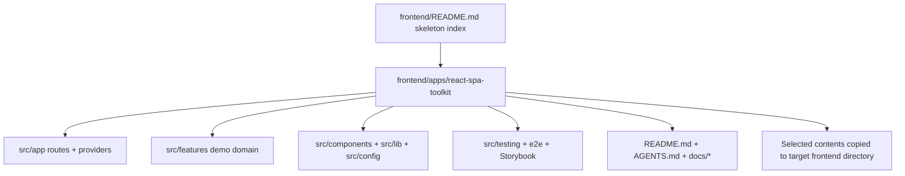

# refactor: Standardize the React SPA toolkit skeleton

## Summary

Rename the frontend skeleton from `frontend/apps/react-vite` to `frontend/apps/react-spa-toolkit`, then align its index entry, package identity, README, AGENTS guidance, local docs, and verification posture with its actual React + Vite product-SPA toolkit shape.

---

## Problem Frame

The current skeleton is not just a generic Vite starter. It already includes route composition, auth, TanStack Query, API helpers, MSW mocks, feature-first source layout, shared UI, Storybook, Plop generation, Vitest, Testing Library, and Playwright. Its name and docs still present it as `react-vite` or an upstream Bulletproof React clone, which makes `skeleton-check` less precise and gives later workflow stages weaker guidance after reuse.

The work should preserve the existing team collaboration demo domain as a reusable reference flow while making the skeleton identity and documentation match the work-bench skeleton library contract.

---

## Requirements

**Skeleton identity**

- R1. The frontend skeleton candidate must live at `frontend/apps/react-spa-toolkit`.
- R2. `frontend/README.md` must list `apps/react-spa-toolkit` exactly once and stop recommending `apps/react-vite`.
- R3. The root package identity should change from `bulletproof-react-vite` to a work-bench-aligned `react-spa-toolkit` name.

**Documentation contract**

- R4. The skeleton root `README.md` must describe purpose, fit, poor fit, stack, setup, verification, mock server usage, e2e flow, and post-copy adaptation points.
- R5. `AGENTS.md` and `docs/*` must describe this as a reusable React SPA skeleton, not as a plain Vite starter or an upstream clone.
- R6. Docs must preserve the team collaboration demo domain as reference material while making clear that it is replaceable.
- R7. Docs must use accurate local paths, script names, config filenames, and copy-boundary language.

**Architecture and behavior preservation**

- R8. The existing app architecture must remain intact: app-level routing/providers, feature-owned business code, shared UI, API client, auth helpers, config, and testing utilities.
- R9. Existing demo flows for landing, auth, app dashboard, discussions, comments, users, and profile must remain available.
- R10. The work must not upgrade dependencies, change React/Vite/router runtime behavior, redesign UI, or add new product features.

**Verification and cleanliness**

- R11. Relevant package checks must pass or report concrete environmental blockers.
- R12. No generated output such as `node_modules`, `dist`, coverage, Playwright reports, or Storybook build artifacts should be included in the final change.
- R13. Static searches should not leave active docs pointing readers to the old `apps/react-vite` candidate or upstream clone setup.

---

## Key Technical Decisions

- KTD1. **Treat this as a skeleton identity refactor:** The code already has the intended SPA capabilities, so implementation should rename and document the existing candidate rather than create a parallel skeleton.
- KTD2. **Use `react-spa-toolkit` as the capability name:** The name communicates a reusable React SPA toolkit and stays broader than `react-dashboard-spa`, which would overfit the skeleton to one UI shape.
- KTD3. **Keep the demo domain:** Auth, teams, discussions, comments, users, and profile flows give future projects concrete route, API, form, and test examples. They should be documented as replaceable examples rather than removed.
- KTD4. **Update docs to actual files, not expected conventions:** This skeleton currently uses `.eslintrc.cjs`, `.prettierrc`, `.env.example`, and `.env.example-e2e`; docs should match those files unless implementation intentionally migrates them.
- KTD5. **Prefer verification through existing Yarn scripts:** The package already exposes `lint`, `check-types`, `test`, `build`, `test-e2e`, `storybook`, and `run-mock-server`; the plan should validate through those rather than introduce new tooling.

---

## High-Level Technical Design



The work keeps the reusable candidate under `frontend/apps/*`. When a real project reuses this skeleton, later workflow stages copy the candidate contents into the target frontend delivery directory, normally `<project-root>/frontend`, without preserving the work-bench library wrapper path.

---

## Scope Boundaries

In scope:

- Rename the candidate directory and update owned references.
- Update frontend skeleton-library index metadata.
- Rewrite the root README as the reader-facing skeleton entry point.
- Align AGENTS and local docs with the actual React SPA toolkit.
- Correct stale or misleading Bulletproof React, clone, old path, and config-file references.
- Run package and static verification, then remove generated artifacts created during verification.

Outside this plan:

- Replacing the demo business domain with a new product.
- Redesigning the UI or landing page.
- Upgrading dependencies or migrating ESLint config shape.
- Converting to Next.js, Remix, or another router/runtime.
- Adding runtime product features.
- Modifying `frontend/apps/nextjs-app` or `frontend/apps/nextjs-pages` except for index references if needed.

---

## Output Structure

```text
frontend/
  README.md
  apps/
    react-spa-toolkit/
      README.md
      AGENTS.md
      package.json
      docs/
      src/
      e2e/
      public/
      generators/
```

---

## Implementation Units

### U1. Rename the React SPA skeleton candidate and update the frontend index

- **Goal:** Move the candidate from `frontend/apps/react-vite` to `frontend/apps/react-spa-toolkit` and update the skeleton catalog.
- **Requirements:** R1, R2, R3, R12, R13.
- **Dependencies:** None.
- **Files:**
  - `frontend/README.md`
  - `frontend/apps/react-vite`
  - `frontend/apps/react-spa-toolkit`
  - `frontend/apps/react-spa-toolkit/package.json`
  - `frontend/apps/react-spa-toolkit/yarn.lock`
- **Approach:** Use a normal filesystem rename so git can detect continuity. Update the frontend index row to name the candidate as a React SPA toolkit for authenticated product SPAs, dashboards, and internal tools that do not need SSR. Update package identity to `react-spa-toolkit` while preserving version, private package status, scripts, dependency versions, and lockfile consistency.
- **Patterns to follow:** Preserve the table style in `frontend/README.md` and the package metadata style in existing frontend skeletons.
- **Test scenarios:**
  - Static search finds no active frontend index recommendation for `apps/react-vite`.
  - `frontend/README.md` links to `apps/react-spa-toolkit` for README, AGENTS, and docs.
  - The old candidate directory is gone and the new candidate directory contains the prior skeleton content.
  - Package scripts and dependency versions are unchanged except for package identity if required.
- **Verification:** Git diff review and static path search.

### U2. Rewrite the skeleton README as a reusable candidate entry point

- **Goal:** Replace the upstream-style README with work-bench skeleton guidance.
- **Requirements:** R4, R5, R6, R7, R9, R10.
- **Dependencies:** U1.
- **Files:**
  - `frontend/apps/react-spa-toolkit/README.md`
  - `frontend/apps/react-spa-toolkit/package.json`
  - `frontend/apps/react-spa-toolkit/.env.example`
  - `frontend/apps/react-spa-toolkit/.env.example-e2e`
- **Approach:** Document what the skeleton is, when to reuse it, when not to reuse it, stack summary, setup commands, mock server flow, e2e flow, Storybook, generator usage, verification commands, and post-copy adaptation points. Remove clone instructions for the upstream repository and explain that the demo domain is a replaceable example.
- **Patterns to follow:** Use the concise skeleton-candidate style from `frontend/README.md`; keep command names grounded in `package.json`.
- **Test scenarios:**
  - README identifies `react-spa-toolkit` as a reusable skeleton candidate.
  - README does not instruct users to clone the upstream Bulletproof React repository.
  - README lists real scripts from `package.json`, including `dev`, `run-mock-server`, `test-e2e`, `storybook`, and `generate`.
  - README explains the target-project copy boundary as the target frontend delivery directory.
  - README points post-copy changes at package metadata, env values, API URL, mock policy, demo domain replacement, route paths, and visual branding.
- **Verification:** Static doc review and script-name comparison against `package.json`.

### U3. Align AGENTS and local docs with actual skeleton architecture

- **Goal:** Make agent-facing and local docs accurately describe the React SPA toolkit, its source layout, commands, and reusable boundaries.
- **Requirements:** R5, R6, R7, R8, R9, R10, R13.
- **Dependencies:** U1, U2.
- **Files:**
  - `frontend/apps/react-spa-toolkit/AGENTS.md`
  - `frontend/apps/react-spa-toolkit/docs/application-overview.md`
  - `frontend/apps/react-spa-toolkit/docs/project-structure.md`
  - `frontend/apps/react-spa-toolkit/docs/project-standards.md`
  - `frontend/apps/react-spa-toolkit/docs/api-layer.md`
  - `frontend/apps/react-spa-toolkit/docs/state-management.md`
  - `frontend/apps/react-spa-toolkit/docs/testing.md`
  - `frontend/apps/react-spa-toolkit/docs/components-and-styling.md`
  - `frontend/apps/react-spa-toolkit/docs/performance.md`
  - `frontend/apps/react-spa-toolkit/docs/error-handling.md`
  - `frontend/apps/react-spa-toolkit/docs/security.md`
  - `frontend/apps/react-spa-toolkit/docs/deployment.md`
  - `frontend/apps/react-spa-toolkit/docs/additional-resources.md`
- **Approach:** Update paths from `apps/react-vite` to `apps/react-spa-toolkit`, reword upstream branding into optional learning references, and correct stale examples that point to missing files. Keep architecture docs centered on `src/app`, `src/features`, `src/components`, `src/lib`, `src/config`, `src/testing`, and `e2e`.
- **Patterns to follow:** Keep the feature-first architecture and unidirectional import guidance already present in `docs/project-structure.md` and `.eslintrc.cjs`.
- **Test scenarios:**
  - AGENTS uses the new directory name and accurate commands.
  - Docs describe `.eslintrc.cjs`, `.prettierrc`, `.env.example`, and `.env.example-e2e` only when those files exist.
  - Testing docs reference existing test paths or general patterns, not missing example files.
  - State management docs do not point to non-existent shared stores unless they frame them as optional future examples.
  - Deployment docs describe static SPA hosting and API environment configuration without implying SSR support.
  - Bulletproof React references remain only as optional external learning resources, not as skeleton identity or setup instructions.
- **Verification:** Static search for stale path, upstream clone, and missing-file references; spot-check doc links against the renamed directory.

### U4. Preserve runtime behavior while tightening skeleton identity references

- **Goal:** Keep app behavior intact while removing identity drift that would confuse copied projects.
- **Requirements:** R3, R8, R9, R10, R11, R13.
- **Dependencies:** U1, U2, U3.
- **Files:**
  - `frontend/apps/react-spa-toolkit/src/app/router.tsx`
  - `frontend/apps/react-spa-toolkit/src/app/provider.tsx`
  - `frontend/apps/react-spa-toolkit/src/config/env.ts`
  - `frontend/apps/react-spa-toolkit/src/config/paths.ts`
  - `frontend/apps/react-spa-toolkit/src/lib/api-client.ts`
  - `frontend/apps/react-spa-toolkit/src/lib/auth.tsx`
  - `frontend/apps/react-spa-toolkit/src/testing/mocks/utils.ts`
  - `frontend/apps/react-spa-toolkit/src/app/routes/landing.tsx`
  - `frontend/apps/react-spa-toolkit/index.html`
  - `frontend/apps/react-spa-toolkit/public/*`
- **Approach:** Inspect identity-bearing runtime strings after docs are aligned. Change only strings that would make the skeleton identify itself as Bulletproof React or the old path in generated/copyable projects. Preserve routes, data flow, auth behavior, mocks, and component structure.
- **Patterns to follow:** Use existing env parsing in `src/config/env.ts`, route constants in `src/config/paths.ts`, and provider composition in `src/app/provider.tsx`.
- **Test scenarios:**
  - The landing route no longer presents the work-bench skeleton as the upstream project unless the link is clearly an optional reference.
  - Auth cookie naming is either intentionally generic or documented as a post-copy adaptation point.
  - Env parsing still accepts the same `VITE_APP_*` variables.
  - Route paths for landing, auth, app dashboard, discussions, users, and profile are unchanged.
  - Shared UI, feature modules, mocks, and e2e tests do not need import-path rewrites beyond the directory rename.
- **Verification:** Existing tests plus focused static review of identity-bearing strings.

### U5. Verify the renamed skeleton and clean generated artifacts

- **Goal:** Prove the renamed skeleton is internally consistent and clean enough for reuse.
- **Requirements:** R1 through R13.
- **Dependencies:** U1, U2, U3, U4.
- **Files:**
  - `frontend/README.md`
  - `frontend/apps/react-spa-toolkit/package.json`
  - `frontend/apps/react-spa-toolkit/yarn.lock`
  - `frontend/apps/react-spa-toolkit/docs/*`
  - `frontend/apps/react-spa-toolkit/src/*`
  - `frontend/apps/react-spa-toolkit/e2e/*`
- **Approach:** Install dependencies if needed, run the skeleton's existing checks, attempt e2e when Playwright browsers and the mock server path are available, and remove generated artifacts before final diff review. If e2e cannot run because of browser installation, port conflict, or environment limits, record the exact blocker.
- **Patterns to follow:** Use the package's own Yarn scripts and avoid adding repo-global tooling.
- **Test scenarios:**
  - `yarn lint` passes or reports a concrete pre-existing/tooling blocker.
  - `yarn check-types` passes or reports a concrete pre-existing/tooling blocker.
  - `yarn test` passes or reports a concrete pre-existing/tooling blocker.
  - `yarn build` passes or reports a concrete pre-existing/tooling blocker.
  - `yarn test-e2e` passes when local browser/server dependencies are available, or the blocker is documented.
  - Static search finds no active `apps/react-vite`, `React Vite Application`, upstream clone setup, or misleading Bulletproof React identity references in changed docs.
  - No dependency install, build, coverage, Playwright, Storybook, or cache artifacts remain staged.
- **Verification:** Package-script output, static search, generated-artifact scan, and git diff review.

---

## System-Wide Impact

This plan affects the frontend skeleton library contract, not a shipped application. The main downstream consumers are `skeleton-check`, later workflow skills that copy a selected skeleton into a real project, and agents or humans reading the candidate docs before reuse. The old path should not remain as an active choice after the rename.

---

## Risks & Dependencies

- **Rename noise in git:** The directory move may appear as many deletes and untracked files before staging. Implementation should stage the rename together so git can detect continuity.
- **Existing backend worktree changes:** Current unrelated backend skeleton changes must remain untouched unless the user explicitly asks to include them.
- **E2E environment variance:** `yarn test-e2e` depends on Playwright browser availability, a dev server, and the mock server flow. A local blocker should be reported precisely rather than treated as a plan failure.
- **Over-cleaning upstream references:** Some Bulletproof React references may be useful as optional learning resources. Implementation should remove identity/setup confusion without erasing legitimate attribution or external learning links.

---

## Documentation / Operational Notes

- `frontend/README.md` remains only the skeleton-library index; it should not define real project delivery paths.
- `frontend/apps/react-spa-toolkit/README.md` becomes the local candidate entry point for humans and agents.
- `AGENTS.md` should stay concise and operational: source layout, commands, boundaries, and verification.
- Local docs should avoid duplicating the entire README; they should explain architecture and conventions at the level future projects can reuse.

---

## Sources & Research

- Origin design: `docs/superpowers/specs/2026-06-11-react-spa-toolkit-skeleton-design.md`.
- Existing skeleton index: `frontend/README.md`.
- Current candidate entry docs: `frontend/apps/react-vite/README.md` and `frontend/apps/react-vite/AGENTS.md`.
- Current package scripts and dependencies: `frontend/apps/react-vite/package.json`.
- Current source architecture examples: `frontend/apps/react-vite/src/app/router.tsx`, `frontend/apps/react-vite/src/app/provider.tsx`, `frontend/apps/react-vite/src/config/env.ts`, and `frontend/apps/react-vite/src/config/paths.ts`.
- Current testing and e2e setup: `frontend/apps/react-vite/src/testing`, `frontend/apps/react-vite/e2e`, and `frontend/apps/react-vite/playwright.config.ts`.
