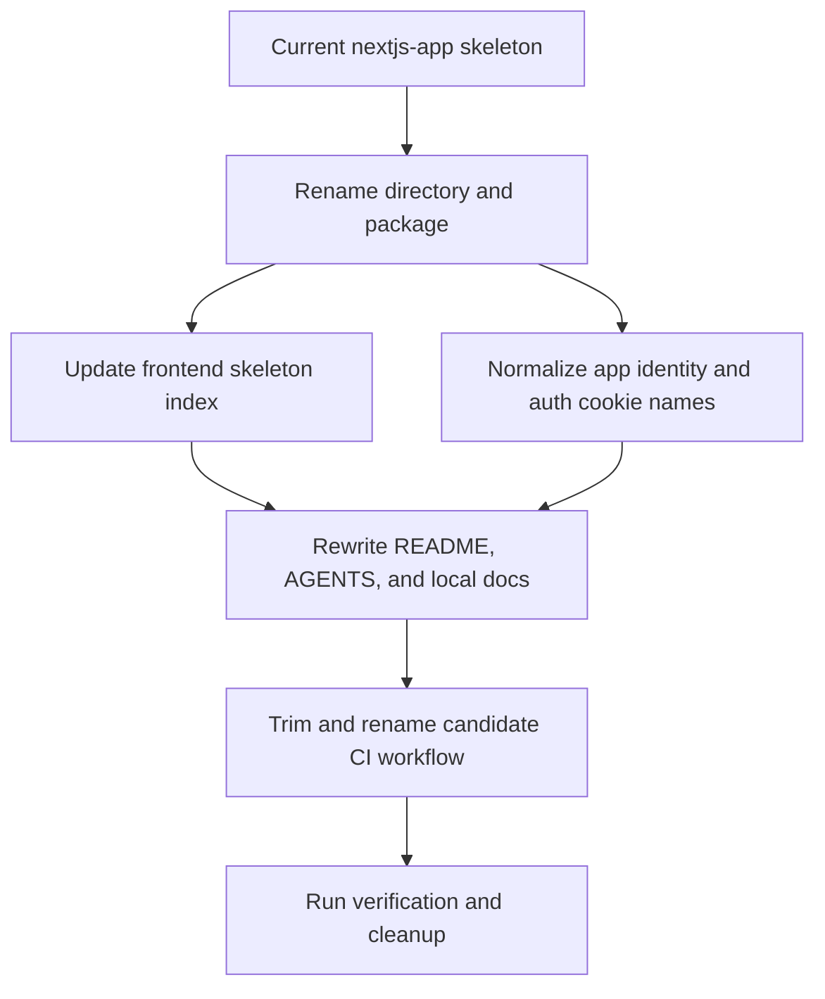

# refactor: Standardize Next.js App Router toolkit skeleton

## Summary

Rename and standardize the `nextjs-app` frontend skeleton as `nextjs-app-router-toolkit`, preserving the existing App Router sample while removing upstream identity drift and stale cross-candidate workflow files.

---

## Problem Frame

`frontend/apps/nextjs-app` already behaves like a reusable Next.js App Router skeleton, but its package name, README, visible copy, auth cookie names, docs, and skeleton-local CI still describe Bulletproof React, Pages Router, or unrelated frontend candidates. That drift makes `skeleton-check` harder to trust and makes copying the skeleton into a real project more ambiguous.

---

## Requirements

- R1. The skeleton directory is renamed from `frontend/apps/nextjs-app` to `frontend/apps/nextjs-app-router-toolkit`.
- R2. The package, app metadata, visible skeleton identity, mock auth cookie names, README, AGENTS guidance, and local docs use `Next.js App Router Toolkit` terminology.
- R3. `frontend/README.md` lists the renamed candidate with accurate App Router fit, poor-fit, guidance links, and verification entry points.
- R4. The skeleton-local workflow directory contains only workflows that apply to this candidate and references `apps/nextjs-app-router-toolkit`.
- R5. The existing sample domain, route groups, mock API behavior, Storybook setup, unit tests, integration tests, and e2e flows remain intact except for identity and path updates.
- R6. Final verification covers install integrity, linting, typechecking, unit/integration tests, production build, e2e behavior, and cleanup of generated artifacts.

---

## Key Technical Decisions

- KTD1. Keep this as a rename-and-standardize refactor: the design explicitly preserves the team collaboration sample and avoids a product redesign.
- KTD2. Use `nextjs-app-router-toolkit` for the directory and package: this matches the existing toolkit naming pattern and distinguishes the candidate from `nextjs-pages`.
- KTD3. Treat Bulletproof React mentions as removable skeleton identity except where an external article is intentionally listed as an optional resource.
- KTD4. Keep framework versions pinned by the existing lockfile: dependency upgrades are out of scope and would add unrelated migration risk.
- KTD5. Verify after rename with the existing project scripts rather than introducing new tooling.

---

## High-Level Technical Design

The implementation should keep the code path changes mechanical first, then adjust documentation and CI after the new canonical path exists.

---

## Scope Boundaries

### In Scope

- The `nextjs-app` skeleton and its references from the frontend skeleton index.
- Skeleton-owned docs, app metadata, user-facing template copy, workflow paths, and mock auth cookie identifiers.
- Verification and cleanup needed to prove the renamed skeleton still works.

### Deferred to Follow-Up Work

- Similar cleanup for `frontend/apps/nextjs-pages`.
- Visual redesign of the sample landing page or dashboard beyond replacing obsolete identity.
- Dependency upgrades for Next.js, React, Storybook, Playwright, ESLint, or testing libraries.

### Out of Scope

- Any backend skeleton work.
- Changes to `frontend/apps/react-spa-toolkit` except as a pattern reference.
- Changing real project destination rules for `skeleton-check`.

---

## Implementation Units

### U1. Rename Skeleton Path And Package Identity

**Goal:** Establish `nextjs-app-router-toolkit` as the canonical skeleton directory and package identity.

**Requirements:** R1, R2, R5.

**Dependencies:** None.

**Files:**

- `frontend/apps/nextjs-app`
- `frontend/apps/nextjs-app-router-toolkit`
- `frontend/apps/nextjs-app-router-toolkit/package.json`
- `frontend/apps/nextjs-app-router-toolkit/yarn.lock`

**Approach:** Move the directory wholesale before editing internal files. Update `package.json` name from the current Bulletproof/Pages value to `nextjs-app-router-toolkit`. Update lockfile package metadata only where it represents the root workspace package name.

**Patterns to follow:** The naming style in `frontend/apps/react-spa-toolkit/package.json` and `frontend/README.md`.

**Test scenarios:**

- Test expectation: none -- this unit is a filesystem/package identity change; behavior is covered by later lint, typecheck, build, and e2e verification.

**Verification:** The old path is absent, the new path exists, package metadata uses the new name, and no package metadata still claims this App Router skeleton is Pages Router.

### U2. Update Skeleton Index And Candidate Selection Metadata

**Goal:** Make the work-bench frontend skeleton index point to the renamed App Router candidate.

**Requirements:** R3.

**Dependencies:** U1.

**Files:**

- `frontend/README.md`

**Approach:** Replace the `apps/nextjs-app` candidate row with `apps/nextjs-app-router-toolkit`. Keep the Best for / Poor fit for distinction focused on App Router, server-capable structure, and SSR/server component needs. Keep `apps/nextjs-pages` as the separate Pages Router candidate.

**Patterns to follow:** The existing `apps/react-spa-toolkit` row shape in `frontend/README.md`.

**Test scenarios:**

- Test expectation: none -- this is skeleton index documentation; verification is link/path consistency and text review.

**Verification:** Every link in the App Router row points to the renamed directory, and no index row confuses App Router with Pages Router or SPA-only usage.

### U3. Normalize Runtime Skeleton Identity

**Goal:** Remove stale Bulletproof React runtime identity while preserving the sample app behavior.

**Requirements:** R2, R5.

**Dependencies:** U1.

**Files:**

- `frontend/apps/nextjs-app-router-toolkit/index.html`
- `frontend/apps/nextjs-app-router-toolkit/src/app/layout.tsx`
- `frontend/apps/nextjs-app-router-toolkit/src/app/page.tsx`
- `frontend/apps/nextjs-app-router-toolkit/src/app/auth/layout.tsx`
- `frontend/apps/nextjs-app-router-toolkit/src/app/app/_components/dashboard-layout.tsx`
- `frontend/apps/nextjs-app-router-toolkit/src/utils/auth.ts`
- `frontend/apps/nextjs-app-router-toolkit/src/testing/mocks/utils.ts`
- `frontend/apps/nextjs-app-router-toolkit/src/testing/mocks/handlers/auth.ts`
- `frontend/apps/nextjs-app-router-toolkit/src/testing/test-utils.tsx`
- Relevant tests under `frontend/apps/nextjs-app-router-toolkit/src/**/__tests__`
- `frontend/apps/nextjs-app-router-toolkit/e2e/tests/*.ts`

**Approach:** Replace template identity strings with `Next.js App Router Toolkit`, adjust the landing page external link away from the upstream Bulletproof repository, and rename auth cookie constants to a skeleton-owned value such as `nextjs_app_router_toolkit_token`. Keep route names, accessible labels for demo workflows, and test expectations stable unless the identity copy itself changes.

**Patterns to follow:** The focused identity cleanup already used by `frontend/apps/react-spa-toolkit/src/app/routes/landing.tsx`, `frontend/apps/react-spa-toolkit/src/components/seo/head.tsx`, and `frontend/apps/react-spa-toolkit/src/testing/mocks/utils.ts`.

**Test scenarios:**

- Landing page renders the new toolkit name and the existing Get started flow still routes a logged-out user toward auth.
- Auth metadata no longer renders Bulletproof React copy.
- Mock login/register handlers set the renamed auth cookie and `requireAuth` accepts that cookie.
- Existing authenticated sample flows still create, update, and delete discussions/comments under Playwright.

**Verification:** Search results show no stale runtime Bulletproof identity in the renamed skeleton except any intentionally retained external resource title, and existing tests continue to cover auth and discussion flows.

### U4. Rewrite Skeleton Documentation And Agent Guidance

**Goal:** Make local skeleton docs describe this reusable App Router toolkit rather than the upstream template.

**Requirements:** R2, R5.

**Dependencies:** U1, U3.

**Files:**

- `frontend/apps/nextjs-app-router-toolkit/README.md`
- `frontend/apps/nextjs-app-router-toolkit/AGENTS.md`
- `frontend/apps/nextjs-app-router-toolkit/docs/application-overview.md`
- `frontend/apps/nextjs-app-router-toolkit/docs/project-structure.md`
- `frontend/apps/nextjs-app-router-toolkit/docs/project-standards.md`
- `frontend/apps/nextjs-app-router-toolkit/docs/api-layer.md`
- `frontend/apps/nextjs-app-router-toolkit/docs/state-management.md`
- `frontend/apps/nextjs-app-router-toolkit/docs/testing.md`
- `frontend/apps/nextjs-app-router-toolkit/docs/components-and-styling.md`
- `frontend/apps/nextjs-app-router-toolkit/docs/performance.md`
- `frontend/apps/nextjs-app-router-toolkit/docs/error-handling.md`
- `frontend/apps/nextjs-app-router-toolkit/docs/security.md`
- `frontend/apps/nextjs-app-router-toolkit/docs/deployment.md`
- `frontend/apps/nextjs-app-router-toolkit/docs/additional-resources.md`

**Approach:** Use `frontend/apps/react-spa-toolkit/README.md` and `frontend/apps/react-spa-toolkit/AGENTS.md` as the shape reference, but adapt the content for Next.js App Router. Document route groups, server/client boundaries, mock API use, reuse boundary, setup, commands, and cleanup expectations. Keep docs concise and avoid duplicating long generic frontend guidance.

**Patterns to follow:** `frontend/apps/react-spa-toolkit/README.md`, `frontend/apps/react-spa-toolkit/AGENTS.md`, and the existing `frontend/README.md` candidate description style.

**Test scenarios:**

- Test expectation: none -- documentation is verified through path checks, stale-name scans, and consistency with package scripts.

**Verification:** README setup starts from the skeleton directory rather than cloning upstream, AGENTS uses `apps/nextjs-app-router-toolkit`, and local docs no longer claim the skeleton is Bulletproof React.

### U5. Align Candidate CI Workflow

**Goal:** Keep only this skeleton's CI workflow inside the renamed skeleton and point it at the new path.

**Requirements:** R4.

**Dependencies:** U1, U2.

**Files:**

- `frontend/apps/nextjs-app-router-toolkit/.github/workflows/nextjs-app-ci.yml`
- `frontend/apps/nextjs-app-router-toolkit/.github/workflows/nextjs-app-router-toolkit-ci.yml`
- `frontend/apps/nextjs-app-router-toolkit/.github/workflows/nextjs-pages-ci.yml`
- `frontend/apps/nextjs-app-router-toolkit/.github/workflows/react-vite-ci.yml`

**Approach:** Rename the App Router workflow to `nextjs-app-router-toolkit-ci.yml`, update display name and working directory to `./apps/nextjs-app-router-toolkit`, and remove workflows for `nextjs-pages` and `react-vite` from this skeleton-local directory. Preserve the existing check categories.

**Patterns to follow:** `frontend/apps/react-spa-toolkit/.github/workflows/react-spa-toolkit-ci.yml`.

**Test scenarios:**

- Test expectation: none -- workflow correctness is covered by static path inspection and by running the same scripts locally.

**Verification:** No workflow under the renamed skeleton references `apps/nextjs-app`, `apps/nextjs-pages`, or `apps/react-vite`.

### U6. Run Final Verification And Cleanup

**Goal:** Prove the renamed skeleton remains usable and leave the worktree free of generated artifacts.

**Requirements:** R6.

**Dependencies:** U1, U2, U3, U4, U5.

**Files:**

- `frontend/apps/nextjs-app-router-toolkit/.env.example`
- `frontend/apps/nextjs-app-router-toolkit/.env.example-e2e`
- `frontend/apps/nextjs-app-router-toolkit/playwright.config.ts`
- `frontend/apps/nextjs-app-router-toolkit/vitest.config.ts`
- `frontend/apps/nextjs-app-router-toolkit/tsconfig.json`
- Generated artifacts to remove after verification, if present.

**Approach:** Install from the lockfile, prepare the local environment from existing examples when needed, and run the existing lint, typecheck, test, build, and e2e surfaces. After verification, remove generated dependency/build/report/runtime files and confirm no mock server or Playwright process remains.

**Patterns to follow:** The cleanup expectations in `frontend/apps/react-spa-toolkit/README.md` and the verification list in the origin design.

**Test scenarios:**

- Unit/integration test suite passes under Vitest after identity and cookie changes.
- Production build succeeds after App Router metadata and server/client boundary changes.
- Playwright e2e still covers auth setup, profile update, and discussion/comment flows.

**Verification:** Install, lint, typecheck, unit/integration tests, production build, e2e, stale-name scan, generated-artifact scan, and process cleanup all complete or any environment-specific blocker is recorded with exact failure context.

---

## System-Wide Impact

This change affects the frontend skeleton library contract used by `skeleton-check`. The real project copy target remains the target project's top-level `frontend` directory; the work-bench `apps/` wrapper is still only a skeleton library organization detail.

---

## Risks And Dependencies

- Existing uncommitted backend and React SPA skeleton work makes `git status` noisy, so implementation must inspect diffs and stage intentionally.
- Directory renaming can hide stale string references until after the move, so implementation needs both path scans and identity scans.
- App Router server/client boundaries may fail only at typecheck or build time, especially around metadata, cookies, and `next/headers`.
- Playwright e2e can leave mock server or PM2 processes behind; cleanup must include process inspection.

---

## Sources And Research

- Origin design: `docs/superpowers/specs/2026-06-11-nextjs-app-router-toolkit-skeleton-design.md`.
- Current App Router skeleton: `frontend/apps/nextjs-app`.
- Frontend skeleton index: `frontend/README.md`.
- Pattern reference from the previous frontend refactor: `frontend/apps/react-spa-toolkit/README.md` and `frontend/apps/react-spa-toolkit/AGENTS.md`.
