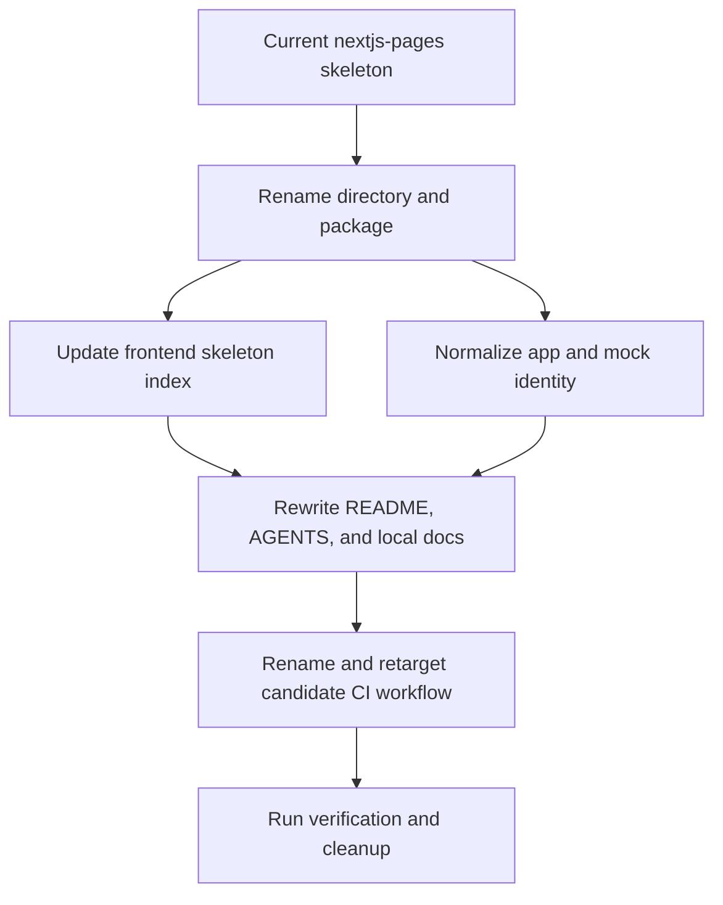

# refactor: Standardize Next.js Pages Router toolkit skeleton

## Summary

Rename and standardize the `nextjs-pages` frontend skeleton as `nextjs-pages-router-toolkit`, preserving its Pages Router sample while removing upstream identity drift and aligning docs, CI, skeleton index metadata, and verification.

---

## Problem Frame

`frontend/apps/nextjs-pages` is already a reusable Next.js Pages Router skeleton, but its package name, README, visible copy, docs, auth cookie name, and CI still carry Bulletproof React or old-path identity. That drift makes `skeleton-check` less reliable and makes the skeleton harder to copy into a real project without cleanup.

---

## Requirements

- R1. The skeleton directory is renamed from `frontend/apps/nextjs-pages` to `frontend/apps/nextjs-pages-router-toolkit`.
- R2. The package, visible app identity, mock auth cookie names, README, AGENTS guidance, and local docs use `Next.js Pages Router Toolkit` terminology.
- R3. `frontend/README.md` lists the renamed candidate with accurate Pages Router fit, poor-fit, guidance links, and verification entry points.
- R4. The skeleton-local workflow is renamed and points to `apps/nextjs-pages-router-toolkit`.
- R5. The existing sample domain, Pages Router files, mock API behavior, Storybook setup, unit tests, integration tests, and e2e flows remain intact except for identity and path updates.
- R6. Final verification covers install integrity, linting, typechecking, unit/integration tests, production build, e2e behavior, stale-name scans, and cleanup of generated artifacts.

---

## Key Technical Decisions

- KTD1. Keep this as a rename-and-standardize refactor: the approved design preserves the team collaboration sample and avoids a product redesign.
- KTD2. Use `nextjs-pages-router-toolkit` for the directory and package: this mirrors `nextjs-app-router-toolkit` and makes Pages Router selection explicit.
- KTD3. Keep `src/pages` as the thin routing layer: the skeleton's main value is Pages Router compatibility, while reusable behavior stays in `src/app`, `src/features`, and shared modules.
- KTD4. Treat Bulletproof React mentions as removable skeleton identity except where an external article is intentionally listed as an optional learning resource.
- KTD5. Keep framework versions pinned by the existing lockfile: dependency upgrades are out of scope and would add unrelated migration risk.
- KTD6. Verify with the existing package scripts rather than adding tooling: the work changes identity and paths, not the stack.

---

## High-Level Technical Design

The implementation should perform the path rename first, then update references in code, documentation, and CI against the new canonical path. Pages Router boundaries must remain intact: `src/pages` owns route entries and SSR hooks, while `src/app` and `src/features` hold reusable behavior.

---

## Scope Boundaries

### In Scope

- The `nextjs-pages` skeleton and its references from the frontend skeleton index.
- Skeleton-owned docs, app metadata, user-facing template copy, workflow paths, and mock auth cookie identifiers.
- Verification and cleanup needed to prove the renamed skeleton still works.

### Deferred to Follow-Up Work

- Visual redesign of the sample landing page or dashboard beyond replacing obsolete identity.
- Dependency upgrades for Next.js, React, Storybook, Playwright, ESLint, or testing libraries.
- Broader restructuring of the sample product domain.

### Out of Scope

- Any backend skeleton work.
- Changes to `frontend/apps/nextjs-app-router-toolkit` or `frontend/apps/react-spa-toolkit` except as pattern references.
- Changing real project destination rules for `skeleton-check`.
- Converting this Pages Router skeleton into an App Router or SPA skeleton.

---

## Implementation Units

### U1. Rename Skeleton Path And Package Identity

**Goal:** Establish `nextjs-pages-router-toolkit` as the canonical skeleton directory and package identity.

**Requirements:** R1, R2, R5.

**Dependencies:** None.

**Files:**

- `frontend/apps/nextjs-pages`
- `frontend/apps/nextjs-pages-router-toolkit`
- `frontend/apps/nextjs-pages-router-toolkit/package.json`
- `frontend/apps/nextjs-pages-router-toolkit/yarn.lock`

**Approach:** Move the directory wholesale before editing internal files. Update `package.json` name from `bulletproof-react-nextjs-pages` to `nextjs-pages-router-toolkit`. Update lockfile package metadata only where it represents the root workspace package name.

**Patterns to follow:** `frontend/apps/nextjs-app-router-toolkit/package.json`, `frontend/apps/react-spa-toolkit/package.json`, and the candidate names in `frontend/README.md`.

**Test scenarios:**

- Test expectation: none -- this unit is a filesystem/package identity change; behavior is covered by later lint, typecheck, build, and e2e verification.

**Verification:** The old path is absent, the new path exists, package metadata uses the new name, and no package metadata still claims this skeleton is Bulletproof React.

### U2. Update Skeleton Index And Candidate Selection Metadata

**Goal:** Make the work-bench frontend skeleton index point to the renamed Pages Router candidate.

**Requirements:** R3.

**Dependencies:** U1.

**Files:**

- `frontend/README.md`

**Approach:** Replace the `apps/nextjs-pages` candidate row with `apps/nextjs-pages-router-toolkit`. Keep the Best for / Poor fit for distinction focused on Pages Router compatibility, traditional Next.js projects, SSR entry points, and avoiding App Router-first or SPA-only use cases.

**Patterns to follow:** The `apps/nextjs-app-router-toolkit` and `apps/react-spa-toolkit` rows in `frontend/README.md`.

**Test scenarios:**

- Test expectation: none -- this is skeleton index documentation; verification is link/path consistency and text review.

**Verification:** Every link in the Pages Router row points to the renamed directory, and the row clearly distinguishes this candidate from App Router and SPA candidates.

### U3. Normalize Runtime Skeleton Identity

**Goal:** Remove stale Bulletproof React runtime identity while preserving sample app behavior.

**Requirements:** R2, R5.

**Dependencies:** U1.

**Files:**

- `frontend/apps/nextjs-pages-router-toolkit/src/pages/index.tsx`
- `frontend/apps/nextjs-pages-router-toolkit/src/components/layouts/dashboard-layout.tsx`
- `frontend/apps/nextjs-pages-router-toolkit/src/testing/mocks/utils.ts`
- `frontend/apps/nextjs-pages-router-toolkit/src/testing/mocks/handlers/auth.ts`
- `frontend/apps/nextjs-pages-router-toolkit/src/testing/test-utils.tsx`
- Relevant tests under `frontend/apps/nextjs-pages-router-toolkit/src/**/__tests__`
- `frontend/apps/nextjs-pages-router-toolkit/e2e/tests/*.ts`

**Approach:** Replace template identity strings with `Next.js Pages Router Toolkit`, adjust the landing page external link away from the upstream Bulletproof repository, and rename auth cookie constants to a skeleton-owned value such as `nextjs_pages_router_toolkit_token`. Keep route names, accessible labels for demo workflows, and test expectations stable unless the identity copy itself changes.

**Patterns to follow:** Identity cleanup in `frontend/apps/nextjs-app-router-toolkit/src/app/page.tsx`, `frontend/apps/nextjs-app-router-toolkit/src/testing/mocks/utils.ts`, and `frontend/apps/react-spa-toolkit/src/testing/mocks/utils.ts`.

**Test scenarios:**

- Landing page renders the new toolkit name and the existing Get started flow still routes a logged-out user toward auth.
- Mock login/register handlers set the renamed auth cookie and `requireAuth` accepts that cookie.
- Authenticated test utilities continue to create an authenticated browser or component state.
- Existing authenticated sample flows still create, update, and delete discussions/comments under Playwright.

**Verification:** Search results show no stale runtime Bulletproof identity in the renamed skeleton except intentionally retained external resource titles, and existing auth/discussion tests continue to pass.

### U4. Rewrite Skeleton Documentation And Agent Guidance

**Goal:** Make local skeleton docs describe this reusable Pages Router toolkit rather than the upstream template.

**Requirements:** R2, R5.

**Dependencies:** U1, U3.

**Files:**

- `frontend/apps/nextjs-pages-router-toolkit/README.md`
- `frontend/apps/nextjs-pages-router-toolkit/AGENTS.md`
- `frontend/apps/nextjs-pages-router-toolkit/docs/application-overview.md`
- `frontend/apps/nextjs-pages-router-toolkit/docs/project-structure.md`
- `frontend/apps/nextjs-pages-router-toolkit/docs/project-standards.md`
- `frontend/apps/nextjs-pages-router-toolkit/docs/api-layer.md`
- `frontend/apps/nextjs-pages-router-toolkit/docs/state-management.md`
- `frontend/apps/nextjs-pages-router-toolkit/docs/testing.md`
- `frontend/apps/nextjs-pages-router-toolkit/docs/components-and-styling.md`
- `frontend/apps/nextjs-pages-router-toolkit/docs/performance.md`
- `frontend/apps/nextjs-pages-router-toolkit/docs/error-handling.md`
- `frontend/apps/nextjs-pages-router-toolkit/docs/security.md`
- `frontend/apps/nextjs-pages-router-toolkit/docs/deployment.md`
- `frontend/apps/nextjs-pages-router-toolkit/docs/additional-resources.md`

**Approach:** Use `frontend/apps/nextjs-app-router-toolkit/README.md` and `frontend/apps/react-spa-toolkit/AGENTS.md` as shape references, but adapt the content for Pages Router. Document thin `src/pages`, SSR entry points, `src/app` composition, mock API use, setup, commands, reuse boundary, and cleanup expectations. Keep docs concise and avoid duplicating long generic frontend guidance.

**Patterns to follow:** `frontend/apps/nextjs-app-router-toolkit/README.md`, `frontend/apps/nextjs-app-router-toolkit/AGENTS.md`, and the existing candidate index style in `frontend/README.md`.

**Test scenarios:**

- Test expectation: none -- documentation is verified through path checks, stale-name scans, and consistency with package scripts.

**Verification:** README setup starts from the skeleton directory rather than cloning upstream, AGENTS uses `apps/nextjs-pages-router-toolkit`, and local docs no longer claim the skeleton is Bulletproof React.

### U5. Align Candidate CI Workflow

**Goal:** Rename and retarget the skeleton-local CI workflow for the new candidate path.

**Requirements:** R4.

**Dependencies:** U1, U2.

**Files:**

- `frontend/apps/nextjs-pages-router-toolkit/.github/workflows/nextjs-pages-ci.yml`
- `frontend/apps/nextjs-pages-router-toolkit/.github/workflows/nextjs-pages-router-toolkit-ci.yml`

**Approach:** Rename the workflow file to `nextjs-pages-router-toolkit-ci.yml`, update display name and working directory to `./apps/nextjs-pages-router-toolkit`, and preserve the existing check categories. Keep path-ignore behavior only if it still matches the skeleton's intended CI scope.

**Patterns to follow:** `frontend/apps/nextjs-app-router-toolkit/.github/workflows/nextjs-app-router-toolkit-ci.yml` and `frontend/apps/react-spa-toolkit/.github/workflows/react-spa-toolkit-ci.yml`.

**Test scenarios:**

- Test expectation: none -- workflow correctness is covered by static path inspection and by running the same scripts locally.

**Verification:** No workflow under the renamed skeleton references `apps/nextjs-pages`, and the workflow name/path match `nextjs-pages-router-toolkit`.

### U6. Run Final Verification And Cleanup

**Goal:** Prove the renamed skeleton remains usable and leave the worktree free of generated artifacts.

**Requirements:** R6.

**Dependencies:** U1, U2, U3, U4, U5.

**Files:**

- `frontend/apps/nextjs-pages-router-toolkit/.env.example`
- `frontend/apps/nextjs-pages-router-toolkit/.env.example-e2e`
- `frontend/apps/nextjs-pages-router-toolkit/playwright.config.ts`
- `frontend/apps/nextjs-pages-router-toolkit/vitest.config.ts`
- `frontend/apps/nextjs-pages-router-toolkit/tsconfig.json`
- Generated artifacts to remove after verification, if present.

**Approach:** Install from the lockfile, prepare the local environment from existing examples when needed, and run the existing lint, typecheck, test, build, and e2e surfaces. After verification, remove generated dependency/build/report/runtime files and confirm no mock server, Next dev server, or Playwright process remains.

**Patterns to follow:** The verification list in the origin design and the cleanup approach used for the other toolkit skeletons.

**Test scenarios:**

- Unit/integration test suite passes under Vitest after identity and cookie changes.
- Production build succeeds after Pages Router path and metadata changes.
- Playwright e2e still covers auth setup, profile update, and discussion/comment flows.

**Verification:** Install, lint, typecheck, unit/integration tests, production build, e2e, stale-name scan, generated-artifact scan, and process cleanup all complete or any environment-specific blocker is recorded with exact failure context.

---

## System-Wide Impact

This change affects the frontend skeleton library contract used by `skeleton-check`. The real project copy target remains the target project's top-level `frontend` directory; the work-bench `apps/` wrapper is still only a skeleton library organization detail.

---

## Risks & Dependencies

- Existing uncommitted work for other skeletons makes `git status` noisy, so implementation must stage and report only intentional Pages Router files.
- Broad text replacement could accidentally introduce App Router wording into Pages Router docs, so stale-name scans need a focused review rather than blind replacement.
- `next lint` behavior depends on the skeleton's existing Next.js version and config, so verification should use package scripts and record exact failures.
- Playwright e2e can leave PM2, Next dev, or browser artifacts behind; cleanup must remove generated files and stop leftover processes.
- The workflow path currently points to `./apps/nextjs-pages`; missing this update would leave CI broken after the rename.

---

## Sources & Research

- `docs/superpowers/specs/2026-06-11-nextjs-pages-router-toolkit-skeleton-design.md` is the approved design source.
- `frontend/README.md` defines the frontend skeleton index shape that `skeleton-check` reads.
- `frontend/apps/nextjs-pages/AGENTS.md` records the existing Pages Router boundary: thin `src/pages`, application composition in `src/app`, and feature code in `src/features`.
- `frontend/apps/nextjs-pages/.github/workflows/nextjs-pages-ci.yml` shows the current CI path that must be retargeted.
- `docs/plans/2026-06-11-003-refactor-nextjs-app-router-toolkit-skeleton-plan.md` provides the nearest completed plan pattern for a sibling Next.js skeleton.
