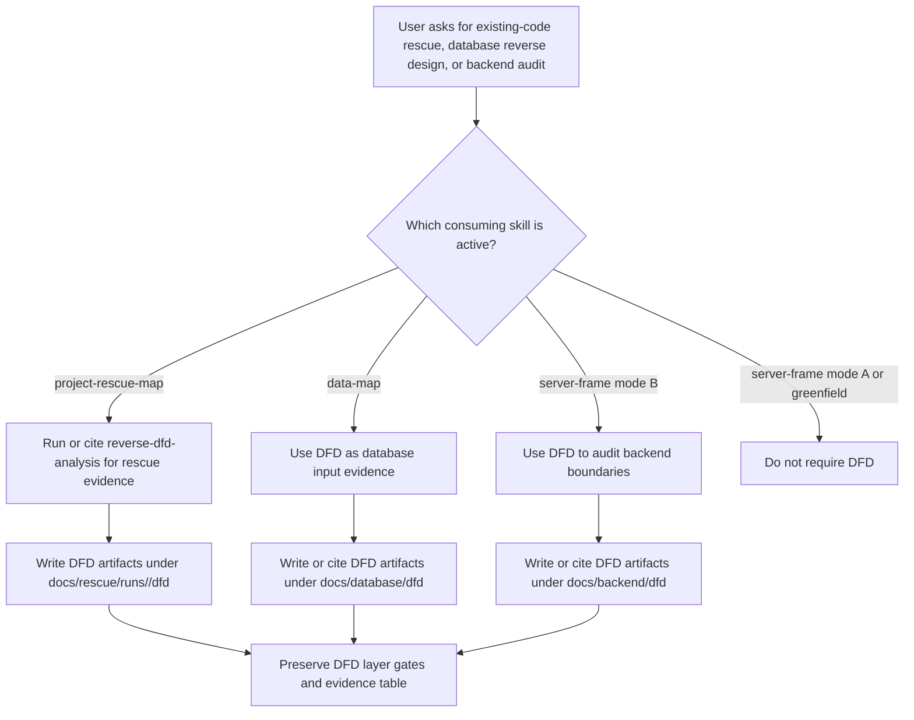

# docs: Integrate reverse DFD evidence into rescue, data, and server skills

## Summary

This plan implements the approved conditional integration design for `reverse-dfd-analysis`. It will preserve the new skill's original DFD behavior, then wire it into `project-rescue-map`, `data-map`, and `server-frame` only for existing-code, rescue, audit, or reverse-engineering scenarios.

---

## Problem Frame

`reverse-dfd-analysis` now exists as a project skill, but the rest of the work-bench flow does not know when to use it. The design document establishes that DFD should become a mandatory evidence layer for messy existing projects, while remaining out of the way for greenfield 0-to-1 work.

The implementation is documentation and skill-rule work. It must be precise because future agents will follow these files as operating instructions.

---

## Requirements

- R1. Keep `reverse-dfd-analysis` functionally equivalent to the original DFD skill while retaining its evidence-index and output-template enhancements.
- R2. `project-rescue-map` must require `reverse-dfd-analysis` in `Standard Rescue Audit` and `Deep Rescue Map` when existing code exposes routes, controllers, services, repositories, SQL, events, or UI components.
- R3. `data-map` must consume DFD evidence when database design is being reverse-engineered from existing code, existing UI, existing APIs, or old-project evidence.
- R4. `server-frame` must require DFD evidence only in mode B for existing backend audit/repair, not in mode A for greenfield backend skeleton creation.
- R5. Every integration must preserve DFD layer gating and must not allow a downstream skill to skip `顶层图` or parent-process prerequisites.
- R6. DFD evidence must remain supporting evidence, not a replacement for ERD, API contract, backend runtime evidence, security baseline, or final acceptance.
- R7. Output paths and handoff references must be explicit enough for future agents to write and consume the DFD artifacts without inventing locations.
- R8. Verification must prove that the intended files changed, no unrelated dirty work was staged, and the final text contains the trigger rules, paths, and hard boundaries from the design.

---

## Key Technical Decisions

- **Use references, not duplicated DFD rules:** The three consuming skills should link to `reverse-dfd-analysis` and state when to invoke it. They should not copy the DFD drawing rules, which would create drift.
- **Add conditional gates near existing workflow gates:** Each skill should mention DFD where agents make intake or mode decisions, so the rule fires before downstream conclusions are written.
- **Keep output paths local to the consuming skill:** Rescue DFD outputs belong in `docs/rescue/runs/<run-id>/dfd/`, database DFD outputs in `docs/database/dfd/`, and backend audit DFD outputs in `docs/backend/dfd/`.
- **Treat this as process-documentation work:** No application tests are expected. Verification should use Markdown/static checks, targeted text searches, and diff review.

---

## High-Level Technical Design

---

## Implementation Units

### U1. Finalize project-local reverse DFD skill

- **Goal:** Ensure the project-local `reverse-dfd-analysis` skill is ready to be referenced by other skills.
- **Requirements:** R1, R5, R6, R8
- **Dependencies:** None
- **Files:**
  - `.codex/skills/reverse-dfd-analysis/SKILL.md`
  - `.codex/skills/reverse-dfd-analysis/references/dfd-style-and-rules.md`
  - `.codex/skills/reverse-dfd-analysis/templates/top-level-dfd.md`
  - `.codex/skills/reverse-dfd-analysis/templates/level-0-dfd.md`
  - `.codex/skills/reverse-dfd-analysis/templates/child-process-dfd.md`
  - `.codex/skills/reverse-dfd-analysis/templates/evidence-index.md`
- **Approach:** Review the untracked project-local skill and keep the original DFD rules intact. If any wording is adjusted, limit it to discovery, evidence indexing, template references, or project-local naming.
- **Patterns to follow:** Existing project skill layout under `.codex/skills/<skill-name>/SKILL.md`; local skill references use relative links such as `../reverse-dfd-analysis/SKILL.md`.
- **Test scenarios:** Test expectation: none -- process documentation only. Verify by diffing `references/dfd-style-and-rules.md` against the original zip content, checking template files exist, and searching for the key gate phrases `不自动连续生成`, `缺少顶层图`, `证据表.md`, and `templates/evidence-index.md`.
- **Verification:** The project-local skill is present, references its templates, keeps the DFD layer gate language, and passes `git diff --check` for the new skill directory.

### U2. Add DFD evidence gate to project-rescue-map

- **Goal:** Make DFD a mandatory evidence layer for existing-code rescue audits.
- **Requirements:** R2, R5, R6, R7, R8
- **Dependencies:** U1
- **Files:**
  - `.codex/skills/project-rescue-map/SKILL.md`
- **Approach:** Add `reverse-dfd-analysis` as a related evidence skill and insert a DFD evidence step near the existing evidence-ledger or diagnostic-flow sections. The rule should fire for `Standard Rescue Audit` and `Deep Rescue Map` when code evidence exists, require `顶层图.md` plus `证据表.md`, and require `0层图.md` when data/API/backend conflicts are being judged.
- **Patterns to follow:** Current rescue wording uses numbered sections, evidence levels, run directories, and explicit output file lists. Keep the new DFD rule in that style.
- **Test scenarios:** Test expectation: none -- process documentation only. Verify with targeted searches for `reverse-dfd-analysis`, `docs/rescue/runs/<run-id>/dfd/顶层图.md`, `docs/rescue/runs/<run-id>/dfd/证据表.md`, `Standard Rescue Audit`, and `Deep Rescue Map`.
- **Verification:** The rescue workflow states when DFD is required, where DFD artifacts land, how evidence is referenced in rescue reports, and that DFD does not replace the 01-10 stage matrix.

### U3. Add DFD evidence consumption to data-map

- **Goal:** Make database reverse design trace business objects, relationships, table specs, and query plans back to DFD evidence.
- **Requirements:** R3, R5, R6, R7, R8
- **Dependencies:** U1
- **Files:**
  - `.codex/skills/03-data-map/SKILL.md`
- **Approach:** Add `reverse-dfd-analysis` to upstream evidence for existing-code and reverse-engineering scenarios. Update the evidence-first workflow and standard output structure so `database-design.md`, `business-object-catalog.md`, `relationship-matrix.md`, and `table-specs.md` can cite DFD elements and evidence table rows.
- **Patterns to follow:** `data-map` already distinguishes confirmed, reasonable inference, and pending confirmation. DFD-derived fields should preserve that same evidence taxonomy.
- **Test scenarios:** Test expectation: none -- process documentation only. Verify with searches for `docs/database/dfd/顶层图.md`, `DFD 输入证据`, `来源 DFD 元素/证据`, and text that says DFD does not replace ERD or migration planning.
- **Verification:** Existing database-design hard rules remain intact, DFD is conditional on reverse-engineered evidence, and the output templates include traceability back to DFD without forcing greenfield projects to draw DFD first.

### U4. Add DFD audit gate to server-frame mode B

- **Goal:** Use DFD evidence to strengthen existing backend audits without burdening greenfield backend skeleton creation.
- **Requirements:** R4, R5, R6, R7, R8
- **Dependencies:** U1
- **Files:**
  - `.codex/skills/07-server-frame/SKILL.md`
- **Approach:** Add a mode-B-only DFD rule near the existing "模式 B：现有后端代码梳理、审计、修复" section. The rule should use DFD to inspect route/controller/service/repository/data-store boundaries and sensitive data flows, while explicitly excluding mode A from the requirement.
- **Patterns to follow:** `server-frame` already has separate mode A and mode B flows, Context7 documentation rules, security baseline requirements, and output artifact lists. Keep DFD language in those same structures.
- **Test scenarios:** Test expectation: none -- process documentation only. Verify with searches for `模式 B`, `docs/backend/dfd/顶层图.md`, `docs/backend/dfd/证据表.md`, `模式 A`, and wording that DFD is static evidence rather than runtime evidence.
- **Verification:** Mode B requires DFD before backend audit conclusions, mode A remains DFD-optional, and backend outputs cite DFD in architecture, file responsibility, security baseline, and acceptance report contexts.

### U5. Cross-skill consistency review and final verification

- **Goal:** Prove that all four skills agree on triggers, boundaries, paths, and evidence behavior.
- **Requirements:** R5, R6, R7, R8
- **Dependencies:** U1, U2, U3, U4
- **Files:**
  - `.codex/skills/reverse-dfd-analysis/SKILL.md`
  - `.codex/skills/project-rescue-map/SKILL.md`
  - `.codex/skills/03-data-map/SKILL.md`
  - `.codex/skills/07-server-frame/SKILL.md`
  - `docs/superpowers/specs/2026-06-11-reverse-dfd-skill-integration-design.md`
- **Approach:** Review diffs against the design document, then run static checks. Confirm no consuming skill copied the full DFD rules, no greenfield path was made mandatory, and every required output path appears exactly where future agents will need it.
- **Patterns to follow:** Previous skill-rule changes in this repo used `git diff --check`, targeted `rg` coverage checks, and manual diff review.
- **Test scenarios:** Test expectation: none -- process documentation only. Verify these scenarios by reading/searching the final text:
  - Existing rescue project with route/controller evidence requires `reverse-dfd-analysis`.
  - Greenfield database design from PRD does not require DFD.
  - Database reverse design from existing API/UI evidence requires DFD evidence or an explicit evidence gap.
  - Backend mode B audit requires DFD evidence.
  - Backend mode A skeleton creation does not require DFD.
  - Missing DFD parent layers are treated as blockers for deeper DFD output, not silently skipped.
- **Verification:** `git diff --check` passes for all touched files; targeted searches cover every path and gate from the design; final `git diff --name-only` contains only the four skill files plus the already-created project-local DFD skill files if they are included in the implementation commit.

---

## Scope Boundaries

### In Scope

- Project-local `reverse-dfd-analysis` skill readiness.
- Conditional references from `project-rescue-map`, `data-map`, and `server-frame`.
- Output path and evidence-handoff wording.
- Static verification for documentation correctness.

### Deferred to Follow-Up Work

- Adding `reverse-dfd-analysis` to `build-map`.
- Adding direct DFD references to `talk-link`, `final-check`, or `work-plan`.
- Building automation that generates Mermaid DFD from code.
- Creating a shared cross-skill template registry.

### Out of Scope

- Running reverse DFD analysis on a real target project.
- Changing application code, database schemas, framework skeletons, or runtime tests.
- Reworking the existing 00-10 workflow beyond the three target integrations.

---

## Risks & Dependencies

- **Rule drift:** Copying DFD drawing rules into three consumers would make future maintenance harder. Mitigation: consumers only reference `reverse-dfd-analysis` and state their own trigger/output behavior.
- **Over-triggering:** If wording is too broad, greenfield flows may become slower. Mitigation: every consuming skill must state the existing-code condition and the greenfield exception.
- **Under-triggering:** If wording is buried in output sections only, agents may make conclusions before DFD evidence is collected. Mitigation: add the gate near intake or mode-selection sections.
- **Dirty worktree:** The repo has many unrelated changes. Mitigation: stage only the intended skill and plan files, and inspect staged names before committing.

---

## Documentation and Operational Notes

This work changes project skill behavior. The implementation report should list every touched skill, state that no application tests were run because the change is documentation-only, and include the exact static verification commands/results used.

---

## Sources and Research

- `docs/superpowers/specs/2026-06-11-reverse-dfd-skill-integration-design.md`
- `.codex/skills/reverse-dfd-analysis/SKILL.md`
- `.codex/skills/project-rescue-map/SKILL.md`
- `.codex/skills/03-data-map/SKILL.md`
- `.codex/skills/07-server-frame/SKILL.md`
