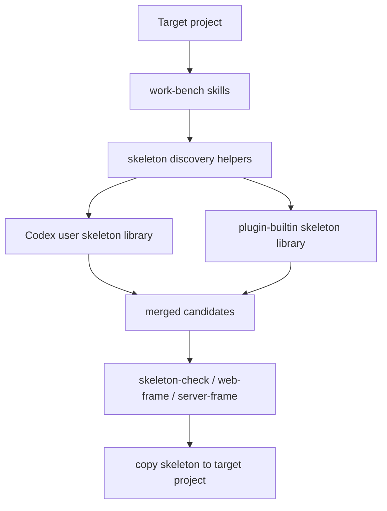

# feat: Package work-bench as a global Codex plugin

## Summary

Package `work-bench` as a distributable Codex plugin from the repository root. The first implementation keeps the existing project skill library, adds a top-level plugin skill export, adds plugin metadata, documents global usage, and introduces skeleton discovery helpers that merge user-global skeletons with plugin-builtin skeletons.

---

## Problem Frame

`work-bench` is already a skill and skeleton library, but it currently behaves like a project-local workspace. Users who want to reuse it globally need a valid plugin manifest, install-oriented docs, and a stable rule for adding new skeletons without editing plugin cache directories or losing user assets during plugin upgrades.

The approved design chooses a single plugin package that includes skills plus frontend and backend skeletons. This plan adapts that design for distribution by making the current repository root the plugin source root, so someone can install the downloaded project directly instead of using a nested copy under a local development directory.

---

## Requirements

- R1. The repository root is a valid `work-bench` Codex plugin source with `.codex-plugin/plugin.json`.
- R2. Plugin metadata exposes a top-level `skills/` export that stays in sync with the existing project skill library.
- R3. Frontend and backend skeleton libraries ship with the plugin and remain available at their current repo-relative locations.
- R4. User-created skeletons are stored outside the plugin source under a Codex user data directory so plugin updates do not overwrite them.
- R5. Skeleton discovery prefers user-global skeletons over plugin-builtin skeletons when names collide, and reports which source won.
- R6. The plugin docs explain installation, updating, skeleton selection, skeleton copying, and registering new skeletons.
- R7. The implementation validates plugin manifest shape and skill structure before handoff.
- R8. The implementation avoids staging unrelated dirty worktree changes from existing frontend/backend skeleton refactors.

---

## Key Technical Decisions

- KTD1. **Use the repository root as the plugin root:** This makes the downloadable project installable as-is and avoids maintaining a second nested plugin copy.
- KTD2. **Point plugin skills at `./skills/` and keep it synced from `.codex/skills/`:** `plugin-creator` validation requires the manifest path to resolve to `skills`, so the first version keeps the project-local skill directory and adds a plugin-exported mirror.
- KTD3. **Treat `frontend/` and `backend/` as plugin-builtin skeleton libraries:** The plugin ships these directories directly, and skills continue to reference them as the built-in library.
- KTD4. **Store user skeletons under a Codex user data root:** User assets live outside the plugin source and plugin cache, preventing upgrade clobbering.
- KTD5. **Use scripts for discovery and registration, not hidden skill magic:** Helper scripts make the merge rules testable and keep skills focused on workflow instructions.
- KTD6. **Keep marketplace setup as a local development aid:** The repo should be valid as a plugin source; personal marketplace entries help this machine preview the plugin but are not the distribution contract.

---

## High-Level Technical Design



The plugin source is the repo root. The manifest exposes `skills`, while `.codex/skills` remains the project-local editing copy. `frontend/apps` and `backend/apps` remain the built-in skeleton sources. Discovery helpers merge user-global and plugin-builtin candidates before the workflow skills decide reuse, create, or copy behavior.

---

## Output Structure

```text
.
  .codex-plugin/
    plugin.json
  skills/
    00-build-map/
    ...
    reverse-dfd-analysis/
  .codex/
    skills/
      00-build-map/
      ...
      reverse-dfd-analysis/
  frontend/
    README.md
    apps/
      <builtin-frontend-skeleton>/
  backend/
    README.md
    apps/
      <builtin-backend-skeleton>/
  docs/
    plugin-usage.md
    skeleton-library.md
    skeleton-contribution.md
    plans/
      2026-06-11-007-feat-work-bench-global-plugin-plan.md
  scripts/
    work_bench_skeletons.py
  tests/
    test_work_bench_skeletons.py
```

The user-global skeleton library is not stored in the repo. Runtime docs should describe it as `<codex-home>/work-bench/frontend/apps` and `<codex-home>/work-bench/backend/apps`.

---

## Implementation Units

### U1. Add repo-root plugin manifest

- **Goal:** Add the plugin manifest and metadata needed for Codex to recognize the repository as the `work-bench` plugin.
- **Requirements:** R1, R2, R3, R7
- **Dependencies:** None
- **Files:** `.codex-plugin/plugin.json`, `README.md`
- **Approach:** Create `.codex-plugin/plugin.json` with name `work-bench`, semver, description, author metadata, `skills: "./skills/"`, and interface metadata. Add top-level `skills/` from `.codex/skills/`. Omit `apps`, `mcpServers`, `hooks`, logo, icon, and screenshots unless matching files exist.
- **Patterns to follow:** `plugin-creator` manifest sample in `plugin-json-spec.md`; current `README.md` project positioning.
- **Test scenarios:**
  - Manifest validation accepts required fields, semver, interface metadata, and `skills` path.
  - Manifest validation rejects no leftover placeholders.
  - The configured skills path points to the top-level `skills` directory.
- **Verification:** Plugin validator reports the repo root as a valid plugin source.

### U2. Document plugin installation and global usage

- **Goal:** Explain how users install, update, and use the plugin without reading the source tree.
- **Requirements:** R1, R3, R4, R6
- **Dependencies:** U1
- **Files:** `README.md`, `docs/plugin-usage.md`, `docs/skeleton-library.md`, `docs/skeleton-contribution.md`
- **Approach:** Update the root README from “project-local skill and skeleton library” to “downloadable Codex plugin plus library.” Add docs that describe the repo-root plugin source, the built-in skeleton library, the user-global skeleton library, and the update rule that user assets are not written into plugin cache/source paths.
- **Patterns to follow:** Existing concise README style; `docs/superpowers/specs/2026-06-11-work-bench-global-plugin-design.md`.
- **Test scenarios:**
  - A new user can identify the plugin install surface from `README.md`.
  - A user can tell where built-in skeletons live and where new reusable skeletons should be registered.
  - Docs avoid machine-specific absolute paths and use portable placeholders for user data locations.
- **Verification:** Documentation links resolve, and no docs instruct users to edit plugin cache directories.

### U3. Add skeleton discovery and registration helpers

- **Goal:** Provide a testable implementation for listing, copying, and registering frontend/backend skeletons across user-global and plugin-builtin libraries.
- **Requirements:** R3, R4, R5, R6
- **Dependencies:** U1
- **Files:** `scripts/work_bench_skeletons.py`, `tests/test_work_bench_skeletons.py`
- **Approach:** Add a small Python helper with commands or callable functions for `list`, `copy`, and `register`. Discovery should scan user-global first, then plugin-builtin. Each candidate should expose `name`, `kind`, `source`, `path`, and best-effort `stack`/`description` from README or registry metadata.
- **Execution note:** Implement the helper test-first because source precedence and copy safety are the core behavior.
- **Patterns to follow:** Standard library filesystem and JSON handling; existing skeleton README indexes for metadata hints.
- **Test scenarios:**
  - Listing frontend skeletons includes candidates from both user-global and plugin-builtin directories.
  - Listing backend skeletons includes candidates from both user-global and plugin-builtin directories.
  - A user-global skeleton with the same name as a plugin-builtin skeleton wins and is marked `user-global`.
  - Registering a new skeleton copies it into the correct user-global frontend or backend library and updates the matching registry file.
  - Copying a selected skeleton refuses to overwrite a non-empty target unless the caller explicitly opts into overwrite behavior.
  - Missing user-global directories are treated as empty libraries, not errors.
- **Verification:** Helper tests cover merge precedence, registry update, missing directory handling, and copy safety.

### U4. Teach skeleton-facing skills the global library rule

- **Goal:** Update skill instructions so agents use the merged skeleton library instead of assuming only repo-local `frontend/apps` and `backend/apps`.
- **Requirements:** R3, R4, R5, R6
- **Dependencies:** U3
- **Files:** `.codex/skills/05-skeleton-check/SKILL.md`, `.codex/skills/06-web-frame/SKILL.md`, `.codex/skills/07-server-frame/SKILL.md`, `.codex/skills/00-build-map/SKILL.md`, `.codex/skills/09-doc-rules/SKILL.md`, `skills/05-skeleton-check/SKILL.md`, `skills/06-web-frame/SKILL.md`, `skills/07-server-frame/SKILL.md`, `skills/00-build-map/SKILL.md`, `skills/09-doc-rules/SKILL.md`
- **Approach:** Add a short shared rule to each relevant skill: candidate discovery checks user-global first and plugin-builtin second; create/register flows save reusable skeletons to the user-global library; selected candidates must report `source` and `path`.
- **Patterns to follow:** Existing skill gate language and recently added Context7 / reverse DFD integration rules.
- **Test scenarios:**
  - `skeleton-check` instructions require source labels for every candidate.
  - `web-frame` instructions save reusable frontend skeletons to the user-global frontend library.
  - `server-frame` instructions save reusable backend skeletons to the user-global backend library.
  - `build-map` delegates the merged library behavior instead of duplicating selection logic.
  - `doc-rules` documents new skeleton contribution requirements without replacing skeleton-specific README rules.
- **Verification:** Targeted text checks confirm each skill references user-global and plugin-builtin libraries consistently.

### U5. Validate plugin packaging and development marketplace flow

- **Goal:** Ensure the plugin is valid locally and can be previewed without making marketplace files the distribution source of truth.
- **Requirements:** R1, R2, R7, R8
- **Dependencies:** U1, U2, U3, U4
- **Files:** `.codex-plugin/plugin.json`
- **Approach:** Run the plugin validator against the repo root. If local preview is needed, create or update a personal marketplace entry through the plugin-creator scaffold/update flow rather than hand-editing unrelated marketplace state.
- **Patterns to follow:** `plugin-creator` `validate_plugin.py`; `installing-and-updating.md` cachebuster and reinstall flow.
- **Test scenarios:**
  - Validator accepts the repo-root plugin after all docs and paths are present.
  - Validation does not require absent optional assets, apps, or MCP servers.
  - Marketplace preview entry, if created, points at the intended local plugin source.
- **Verification:** Plugin validation passes, and git status shows only pluginization-related files staged for commit.

---

## Scope Boundaries

### In Scope

- Add plugin manifest and install-facing docs.
- Preserve current skills and skeleton libraries as the plugin’s bundled assets.
- Add helper logic for merged skeleton discovery and user-global registration.
- Update skills that select, create, or document skeletons.

### Deferred to Follow-Up Work

- Move `.codex/skills` to a top-level `skills/` directory after the plugin is proven.
- Add icons, screenshots, or richer marketplace presentation assets.
- Add manifest files to every skeleton candidate.
- Add remote skeleton download or sync behavior.

### Out of Scope

- Refactor frontend or backend skeleton application code.
- Automatically migrate skeletons from unrelated user projects.
- Split `work-bench` into multiple plugins.
- Publish to a public marketplace or package registry in this implementation.

---

## System-Wide Impact

This change affects how all skeleton-related workflow skills interpret the library boundary. Before pluginization, `frontend/apps` and `backend/apps` were the only candidate sources. After pluginization, those directories are built-in sources, and user-created reusable skeletons live outside the plugin package. That distinction must stay visible in reports so users understand whether they are using a bundled skeleton or their own override.

---

## Risks & Dependencies

- **Dirty worktree risk:** The repo currently contains many unrelated frontend/backend skeleton changes. Implementation must stage only pluginization files and inspect staged diff before committing.
- **Path drift risk:** Maintaining both `.codex/skills` and `skills` can drift. Implementation should sync the plugin export after changing project-local skills and verify both copies contain the global library rules.
- **Validator constraint:** The validator is the source of truth for manifest shape and requires `skills` as the manifest skill path.
- **User asset overwrite risk:** Copy/register helpers must not write into plugin cache paths and must guard target overwrites.
- **Docs/source mismatch risk:** Skills and README must describe the same skeleton precedence order.

---

## Documentation and Operational Notes

The user-facing docs should separate three concepts:

- Plugin source: the downloaded `work-bench` repository or installed plugin directory.
- Plugin-builtin skeletons: `frontend/apps` and `backend/apps` shipped with the plugin.
- User-global skeletons: reusable skeletons registered into the Codex user data work-bench library.

The local development marketplace entry is only a preview aid. Distribution instructions should treat the repository itself as the plugin source.

---

## Sources & Research

- `docs/superpowers/specs/2026-06-11-work-bench-global-plugin-design.md` defines the approved single-plugin direction and user-global skeleton rule.
- `README.md` and `WORKFLOW.md` define the current project identity and workflow boundaries.
- `frontend/README.md` and `backend/README.md` define current skeleton index expectations.
- `.codex/skills/05-skeleton-check/SKILL.md`, `.codex/skills/06-web-frame/SKILL.md`, `.codex/skills/07-server-frame/SKILL.md`, `.codex/skills/00-build-map/SKILL.md`, and `.codex/skills/09-doc-rules/SKILL.md` are the skill touchpoints for skeleton discovery and documentation.
- `plugin-creator` references confirm required manifest fields, optional asset handling, validator use, and local marketplace update behavior.
