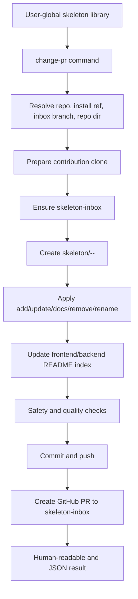

# feat: Add skeleton change PR workflow

## Summary

Implement a `change-pr` workflow that turns any built-in skeleton change into a GitHub PR targeting `skeleton-inbox`. The work extends the existing skeleton helper script, updates docs and skill guidance, adds automated coverage, and ends with a real remote PR smoke test so the workflow is proven against GitHub rather than only unit-tested.

---

## Problem Frame

`work-bench` already supports registering skeletons into a user-global library, but it lacks a safe way to bring complete skeleton changes back into the public plugin repository. Directly pushing these changes to the plugin installation branch would risk publishing unreviewed skeleton assets, while keeping them only in the user-global library prevents reuse by other installations. The planned workflow creates a reviewed path: all add, update, docs, remove, and rename changes become PRs against `skeleton-inbox`.

---

## Requirements

- R1. Add a `change-pr` command that supports `add`, `update`, `docs`, `remove`, and `rename` skeleton changes for both `frontend` and `backend`.
- R2. Use `<codex-home>/work-bench/repo` as the dedicated contribution clone and never edit plugin cache directories.
- R3. Ensure `skeleton-inbox` exists and create contribution branches named from change type, kind, and skeleton name.
- R4. Apply skeleton changes to plugin-builtin paths under `frontend/apps` or `backend/apps` and update the matching skeleton index.
- R5. Generate Chinese PR titles, PR bodies, commit bodies, and index descriptions from README/package metadata when explicit descriptions are unavailable.
- R6. Block commit, push, and PR creation when validation finds unsafe names, missing inputs, generated artifacts, likely secrets, dirty contribution workspaces, missing GitHub auth, empty diffs, or invalid change-state combinations.
- R7. Surface non-blocking skeleton quality warnings in the PR body.
- R8. Provide machine-readable JSON output for downstream Codex/skill callers.
- R9. Update repository docs and relevant work-bench skills so agents know that built-in skeleton changes must use the PR workflow.
- R10. Verify the implementation with unit tests, dry-run integration tests, and one real GitHub PR smoke test after code changes are complete.

---

## Key Technical Decisions

- KTD1. Keep the workflow in `scripts/work_bench_skeletons.py`: The existing helper already owns skeleton list/copy/register behavior, so extending it keeps deterministic file and CLI behavior in one place.
- KTD2. Use a dedicated contribution clone: `<codex-home>/work-bench/repo` avoids mutating plugin cache directories or arbitrary project worktrees.
- KTD3. Target `skeleton-inbox` for all automated PRs: This branch acts as a reviewed holding area and protects the plugin installation ref from direct automation.
- KTD4. Treat real PR creation as a required verification phase: Unit tests prove mechanics, but this workflow depends on `git`, `gh`, remotes, refs, and permissions, so implementation is not complete until a live smoke PR succeeds.
- KTD5. Keep PR creation scriptable and reviewable: The command should support `--dry-run` and `--json`, and default behavior should fail closed when checks cannot prove safety.

---

## High-Level Technical Design

The command should structure its logic into small functions so unit tests can exercise configuration, validation, index generation, branch naming, and PR payload generation without requiring network access. The only live network path should be the final push/PR creation layer and the explicit real smoke test.

---

## Scope Boundaries

In scope:

- Add the `change-pr` command and supporting pure functions.
- Support all change types from the origin spec.
- Update repository docs and mirrored skill exports.
- Add unit tests for validation, change application, metadata generation, and dry-run behavior.
- Run a real remote smoke test that creates a PR and verifies its URL.

Deferred to follow-up work:

- Automatically merging `skeleton-inbox` into `codex/initialize-workbench`.
- Creating a dedicated `skeleton-change-pr` skill wrapper.
- Adding UI or dashboard support for reviewing skeleton changes.
- Supporting non-GitHub providers.

Out of scope:

- Changing the existing user-global registration semantics.
- Modifying generated plugin cache directories.
- Automatically accepting or merging PRs.

---

## Implementation Units

### U1. Add configuration and GitHub workflow primitives

- **Goal:** Give the script reusable primitives for resolving upstream configuration, preparing the contribution clone, managing refs, and creating PRs.
- **Requirements:** R1, R2, R3, R8.
- **Dependencies:** None.
- **Files:**
  - `scripts/work_bench_skeletons.py`
  - `tests/test_work_bench_skeletons.py`
- **Approach:** Add a small configuration object resolved from CLI flags, `<codex-home>/work-bench/config.json`, and defaults. Add subprocess-backed helpers for `git` and `gh` that can be dependency-injected in tests. Keep network and mutation calls behind a dry-run gate.
- **Patterns to follow:** Existing `codex_home()`, `default_user_root()`, `apps_dir()`, and argparse subcommand style in `scripts/work_bench_skeletons.py`.
- **Test scenarios:**
  - Resolve defaults when no config file or flags exist.
  - CLI flags override config file values.
  - Config file values override built-in defaults.
  - Branch names normalize change type, kind, name, and rename target.
  - Dirty contribution workspaces raise before any commit/push/PR action.
- **Verification:** Unit tests prove config precedence and git/gh helper call planning without touching the network.

### U2. Implement change validation and safety checks

- **Goal:** Block unsafe or invalid skeleton changes before the workflow writes to the contribution clone.
- **Requirements:** R1, R6, R7.
- **Dependencies:** U1.
- **Files:**
  - `scripts/work_bench_skeletons.py`
  - `tests/test_work_bench_skeletons.py`
- **Approach:** Add validation functions for skeleton names, change-type state, required arguments, source existence, generated artifacts, secret-like files/content, existing target state, and empty final diffs. Return blocking errors separately from soft warnings so the PR body can report quality warnings when the change is otherwise safe.
- **Patterns to follow:** Existing exception-based guard behavior in `ensure_safe_target()`.
- **Test scenarios:**
  - Invalid names such as `ReactAdmin`, `react_admin`, and `react admin` fail.
  - `add` fails when the built-in target already exists.
  - `update`, `docs`, `remove`, and `rename` fail when the target is missing.
  - `rename` fails when `--new-name` already exists.
  - Sources containing `node_modules`, `dist`, `.next`, or `coverage` fail.
  - Sources containing `.env` with non-example names fail.
  - Sources with placeholder keys such as `your-api-key` warn or pass according to the secret heuristic, while likely real tokens fail.
  - Missing README/AGENTS/docs produce warnings, not hard failures.
- **Verification:** Unit tests cover every hard-failure class and at least three warning-only cases.

### U3. Apply skeleton changes and update indexes

- **Goal:** Translate a validated change request into repository file changes under `frontend/apps`, `backend/apps`, `frontend/README.md`, and `backend/README.md`.
- **Requirements:** R4, R5.
- **Dependencies:** U2.
- **Files:**
  - `scripts/work_bench_skeletons.py`
  - `tests/test_work_bench_skeletons.py`
  - `frontend/README.md`
  - `backend/README.md`
- **Approach:** Add change application functions for `add`, `update`, `docs`, `remove`, and `rename`. Generate or update one table row in the matching skeleton index using source README text, package dependencies, existing docs links, and script metadata. Preserve unrelated index rows and keep deterministic row ordering.
- **Patterns to follow:** Existing frontend/backend README table shapes and `infer_stack()` metadata extraction.
- **Test scenarios:**
  - `add` copies a source skeleton into the correct built-in apps directory and appends one index row.
  - `update` replaces the target skeleton contents and refreshes the same index row.
  - `docs` syncs README/AGENTS/docs without replacing runtime files.
  - `remove` deletes the skeleton and removes its index row.
  - `rename` removes the old row/path and adds the new row/path.
  - Generated Chinese descriptions include purpose, fit, stack, and verification commands when source metadata provides them.
- **Verification:** Unit tests compare filesystem results and README table content for each change type.

### U4. Generate commit, PR, and JSON output payloads

- **Goal:** Produce consistent human-readable and machine-readable output for commits, PRs, and Codex callers.
- **Requirements:** R5, R7, R8.
- **Dependencies:** U2, U3.
- **Files:**
  - `scripts/work_bench_skeletons.py`
  - `tests/test_work_bench_skeletons.py`
- **Approach:** Add payload builders for conventional commit subjects, Chinese PR titles, PR bodies, and JSON result objects. Include warnings, validation summary, target paths, branch names, base branch, commit hash, and PR URL when available.
- **Patterns to follow:** Existing `print_candidates(..., as_json)` pattern for text vs JSON output.
- **Test scenarios:**
  - Each change type maps to the expected commit subject type and Chinese PR title.
  - PR body includes change type, skeleton path, Chinese description, safety checks, warnings, and merge guidance for `skeleton-inbox`.
  - JSON output includes `repo_dir`, `branch`, `base`, `commit`, `pr_url`, and `warnings`.
  - Dry-run output includes planned actions but no commit hash or PR URL.
- **Verification:** Unit tests assert text payloads and JSON schema-like fields.

### U5. Wire the `change-pr` CLI command

- **Goal:** Expose the full workflow through `scripts/work_bench_skeletons.py change-pr`.
- **Requirements:** R1, R2, R3, R4, R5, R6, R7, R8.
- **Dependencies:** U1, U2, U3, U4.
- **Files:**
  - `scripts/work_bench_skeletons.py`
  - `tests/test_work_bench_skeletons.py`
- **Approach:** Extend argparse with the `change-pr` subcommand and flags from the origin spec. The command should execute in this order: resolve config, validate inputs, prepare clone, ensure inbox branch, create contribution branch, apply change, validate final diff, commit, push, create PR, then print text or JSON output. `--dry-run` should perform all local validation and planned-payload generation without mutating remotes.
- **Patterns to follow:** Existing subcommand dispatch in `main()` and simple command output style.
- **Test scenarios:**
  - `change-pr --dry-run --json` returns planned branch/base/output fields for an add.
  - Missing required flags fail with useful argparse or validation errors.
  - Dry-run does not call commit, push, or PR creation helpers.
  - Non-dry-run calls helpers in the expected order when injected test doubles succeed.
  - Empty final diff fails before commit.
- **Verification:** Unit tests cover CLI parsing, dry-run behavior, and happy-path helper sequencing through fakes.

### U6. Update docs and work-bench skills

- **Goal:** Make the workflow discoverable from docs and agent skills.
- **Requirements:** R9.
- **Dependencies:** U5.
- **Files:**
  - `README.md`
  - `docs/skeleton-contribution.md`
  - `docs/skeleton-library.md`
  - `.codex/skills/05-skeleton-check/SKILL.md`
  - `.codex/skills/06-web-frame/SKILL.md`
  - `.codex/skills/07-server-frame/SKILL.md`
  - `.codex/skills/09-doc-rules/SKILL.md`
  - `skills/05-skeleton-check/SKILL.md`
  - `skills/06-web-frame/SKILL.md`
  - `skills/07-server-frame/SKILL.md`
  - `skills/09-doc-rules/SKILL.md`
- **Approach:** Document the distinction between registering personal skeletons and submitting built-in skeleton changes. Add a concise workflow section showing `change-pr` examples and the `skeleton-inbox` review model. Keep `.codex/skills` and exported `skills` copies synchronized.
- **Patterns to follow:** Existing docs under `docs/skeleton-contribution.md`, `docs/skeleton-library.md`, and prior mirrored skill updates.
- **Test scenarios:**
  - Test expectation: none for pure documentation, but static checks should confirm both skill copies mention the same command and branch model.
- **Verification:** Static search confirms docs and both skill trees reference `change-pr`, `skeleton-inbox`, and built-in skeleton change PR rules.

### U7. Add automated verification coverage

- **Goal:** Ensure the new command remains safe and deterministic across future changes.
- **Requirements:** R6, R8, R10.
- **Dependencies:** U1, U2, U3, U4, U5.
- **Files:**
  - `tests/test_work_bench_skeletons.py`
  - `scripts/work_bench_skeletons.py`
- **Approach:** Expand the existing unittest suite with isolated temporary directories and fake git/gh runners. Keep tests independent of the user's real `<codex-home>`, GitHub auth, network, or repository remotes.
- **Patterns to follow:** Existing `tempfile.TemporaryDirectory()` setup in `WorkBenchSkeletonTests`.
- **Test scenarios:**
  - All validation hard-failures from U2.
  - All five change types apply expected filesystem/index changes.
  - Dry-run emits JSON and never calls network helpers.
  - Non-dry-run helper sequencing is correct with fakes.
  - Config precedence is deterministic.
- **Verification:** `python3 -m unittest tests.test_work_bench_skeletons` passes.

### U8. Run real remote PR smoke test

- **Goal:** Prove the implemented workflow works against the real GitHub repository after code changes are complete.
- **Requirements:** R10.
- **Dependencies:** U5, U6, U7.
- **Files:**
  - `scripts/work_bench_skeletons.py`
  - `tests/test_work_bench_skeletons.py`
  - `README.md`
  - `docs/skeleton-contribution.md`
  - `docs/skeleton-library.md`
- **Approach:** Create a temporary minimal skeleton source with README/package metadata, run the real `change-pr` command against `starburtMr/work-bench`, and verify GitHub returns a PR URL targeting `skeleton-inbox`. Use a unique test skeleton name such as `e2e-smoke-<timestamp>` and a unique branch name so reruns do not collide. After verification, close the test PR and delete the remote test branch unless an implementation-time decision keeps the PR for audit.
- **Execution note:** This is a required post-implementation verification step, not a unit test. It should run only after automated tests pass and should use the real `gh` login and remote permissions.
- **Patterns to follow:** The verified plugin install smoke test style already used for `codex plugin marketplace add` and `codex plugin add`, but aimed at the new skeleton PR workflow.
- **Test scenarios:**
  - Given a minimal frontend skeleton source, `change-pr --type add --kind frontend --name e2e-smoke-<timestamp>` creates a commit, pushes a branch, and returns a PR URL.
  - The created PR base is `skeleton-inbox`.
  - The PR body contains the generated Chinese description and safety check summary.
  - The remote `skeleton-inbox` branch exists after the run.
  - Cleanup closes the test PR and deletes the remote contribution branch, or records the PR URL if cleanup fails.
- **Verification:** A real PR URL is captured and inspected with `gh pr view`; cleanup outcome is reported explicitly in the final implementation report.

---

## System-Wide Impact

This change turns `scripts/work_bench_skeletons.py` from a local skeleton library helper into a GitHub contribution workflow entry point. The script will need clearer separation between pure filesystem logic and external side effects so tests can remain local while real verification still exercises GitHub. Documentation and skill changes must preserve the current user-global precedence model: user-global skeletons still win during selection, while built-in skeleton changes become reviewed repository PRs.

---

## Risks And Dependencies

- GitHub auth and permissions are required for the real PR smoke test; if `gh auth status` fails, implementation cannot claim full verification.
- Secret detection can produce false positives or false negatives. The first version should fail closed on high-confidence patterns and document warnings clearly.
- Real PR smoke tests can leave remote branches or PRs behind if cleanup fails. The implementation report must include any leftover PR URL or branch name.
- Updating README table rows programmatically risks formatting churn. Tests should assert deterministic row changes and avoid rewriting unrelated rows.
- Symlinks and plugin marketplace files already exist in this repo; contribution clone operations must preserve them rather than resolving symlinks into copied directory contents.

---

## Documentation And Operational Notes

The final docs should teach two separate operations:

- Register personal skeletons into the user-global library with `register`.
- Submit built-in skeleton add/update/docs/remove/rename changes with `change-pr` to `skeleton-inbox`.

The implementation report must include automated test results and the real PR smoke test result. A claim of completion is not valid unless the real PR flow either succeeds or has a clearly stated external blocker such as missing GitHub auth.

---

## Sources And Research

- Origin design: `docs/superpowers/specs/2026-06-11-skeleton-change-pr-workflow-design.md`.
- Existing skeleton helper: `scripts/work_bench_skeletons.py`.
- Existing tests: `tests/test_work_bench_skeletons.py`.
- Skeleton docs: `docs/skeleton-contribution.md` and `docs/skeleton-library.md`.
- Built-in skeleton indexes: `frontend/README.md` and `backend/README.md`.
